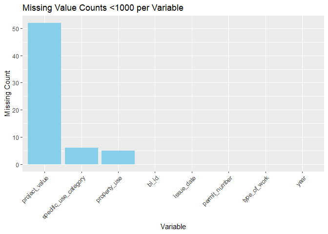
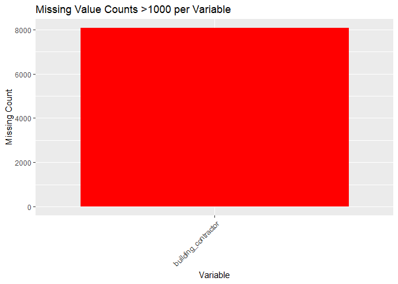
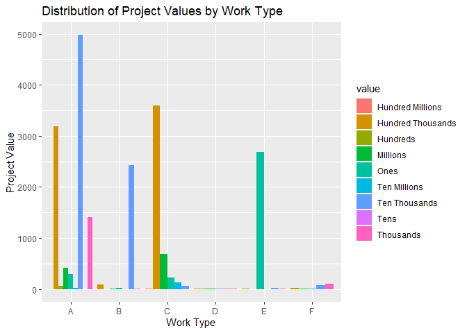
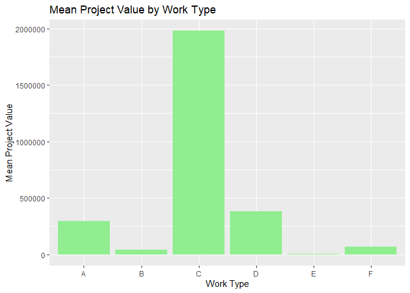

Mini Data Analysis Deliverable 1
================
Kiana Yazdani

2023-10-05

- [Getting Started](#getting-started)
  - [Packages and Libraries](#packages-and-libraries)
  - [GitHub Repository](#github-repository)
    - [<span style="color:red;">Kiana’s MDA
      Repository</span>](#kianas-mda-repository)
- [Assignment Instructions](#assignment-instructions)
  - [For Both Milestones](#for-both-milestones)
  - [For Milestone 1](#for-milestone-1)
    - [Learning Objectives](#learning-objectives)
- [**Task 1:** Choose Your Favorite
  Dataset](#task-1-choose-your-favorite-dataset)
  - [<span style="color:purple;">**Exploring the *“cancer_sample”*
    dataset:**</span>](#exploring-the-cancer_sample-dataset)
  - [<span style="color:purple;">**Exploring the *“flow_sample”*
    dataset:**</span>](#exploring-the-flow_sample-dataset)
  - [<span style="color:purple;">**Exploring the *“building_permits”*
    dataset:**</span>](#exploring-the-building_permits-dataset)
  - [<span style="color:purple;">**Exploring the *“vancouver_trees”*
    dataset:**</span>](#exploring-the-vancouver_trees-dataset)
  - [<span style="color:red;">Finale Dataset and
    Rationale</span>](#finale-dataset-and-rationale)
  - [<span style="color:red;">Research
    Question</span>](#research-question)
- [**Task 2:** Exploring Your Dataset](#task-2-exploring-your-dataset)
  - [<span style="color:purple;">**Introduction**</span>](#introduction)
  - [<span style="color:purple;">**Step 1: Create a Subset of the
    Data**</span>](#step-1-create-a-subset-of-the-data)
  - [<span style="color:purple;">**Step 2: Identify Missing
    Values**</span>](#step-2-identify-missing-values)
  - [<span style="color:purple;">**Step 3: Create a New
    Variable**</span>](#step-3-create-a-new-variable)
  - [<span style="color:purple;">**Step 4: Explore Two Variables’
    Relationship**</span>](#step-4-explore-two-variables-relationship)
- [**Task 3:** Choose Research
  Questions](#task-3-choose-research-questions)
- [Overall reproducibility/Cleanliness/Coherence
  Checklist](#overall-reproducibilitycleanlinesscoherence-checklist)
  - [Coherence (0.5 points)](#coherence-05-points)
  - [Error-free code (3 points)](#error-free-code-3-points)
  - [Main README (1 point)](#main-readme-1-point)
  - [Output (1 point)](#output-1-point)
  - [Tagged release (0.5 points)](#tagged-release-05-points)
    - [Attribution](#attribution)

# Getting Started

Welcome to your (maybe) first-ever data analysis project! And hopefully
the first of many. Let’s get started:

## Packages and Libraries

1.  Install the [`datateachr`](https://github.com/UBC-MDS/datateachr)
    package by typing the following into your **R terminal**:

<!-- -->

    install.packages("datateachr")
    install.packages("devtools")
    devtools::install_github("UBC-MDS/datateachr")

2.  Load the packages below.

``` r
library(datateachr)
library(ggplot2)
library(dplyr)
```

    ## 
    ## Attaching package: 'dplyr'

    ## The following objects are masked from 'package:stats':
    ## 
    ##     filter, lag

    ## The following objects are masked from 'package:base':
    ## 
    ##     intersect, setdiff, setequal, union

``` r
library(tidyverse)
```

    ## ── Attaching core tidyverse packages ──────────────────────── tidyverse 2.0.0 ──
    ## ✔ forcats   1.0.0     ✔ stringr   1.5.0
    ## ✔ lubridate 1.9.2     ✔ tibble    3.2.1
    ## ✔ purrr     1.0.2     ✔ tidyr     1.3.0
    ## ✔ readr     2.1.4

    ## ── Conflicts ────────────────────────────────────────── tidyverse_conflicts() ──
    ## ✖ dplyr::filter() masks stats::filter()
    ## ✖ dplyr::lag()    masks stats::lag()
    ## ℹ Use the conflicted package (<http://conflicted.r-lib.org/>) to force all conflicts to become errors

## GitHub Repository

3.  Make a repository in the <https://github.com/stat545ubc-2023>
    Organization. You can do this by following the steps found on canvas
    in the entry called [MDA: Create a
    repository](https://canvas.ubc.ca/courses/126199/pages/mda-create-a-repository).
    One completed, your repository should automatically be listed as
    part of the stat545ubc-2023 Organization.

### <span style="color:red;">Kiana’s MDA Repository</span>

- **You can find my repository following this link:**
  [KianaYazdani.MDARep](https://github.com/stat545ubc-2023/Kiana_Mini-Data-Analysis.git)

# Assignment Instructions

## For Both Milestones

- Each milestone has explicit tasks. Tasks that are more challenging
  will often be allocated more points.

- Each milestone will be also graded for reproducibility, cleanliness,
  and coherence of the overall Github submission.

- While the two milestones will be submitted as independent
  deliverables, the analysis itself is a continuum - think of it as two
  chapters to a story. Each chapter, or in this case, portion of your
  analysis, should be easily followed through by someone unfamiliar with
  the content.
  [Here](https://swcarpentry.github.io/r-novice-inflammation/06-best-practices-R/)
  is a good resource for what constitutes “good code”. Learning good
  coding practices early in your career will save you hassle later on!

- The milestones will be equally weighted.

## For Milestone 1

**To complete this milestone**, edit [this very `.Rmd`
file](https://raw.githubusercontent.com/UBC-STAT/stat545.stat.ubc.ca/master/content/mini-project/mini-project-1.Rmd)
directly. Fill in the sections that are tagged with
`<!--- start your work below --->`.

**To submit this milestone**, make sure to knit this `.Rmd` file to an
`.md` file by changing the YAML output settings from
`output: html_document` to `output: github_document`. Commit and push
all of your work to the mini-analysis GitHub repository you made
earlier, and tag a release on GitHub. Then, submit a link to your tagged
release on canvas.

**Points**: This milestone is worth 36 points: 30 for your analysis, and
6 for overall reproducibility, cleanliness, and coherence of the Github
submission.

### Learning Objectives

By the end of this milestone, you should:

- Become familiar with your dataset of choosing
- Select 4 questions that you would like to answer with your data
- Generate a reproducible and clear report using R Markdown
- Become familiar with manipulating and summarizing your data in tibbles
  using `dplyr`, with a research question in mind.

# **Task 1:** Choose Your Favorite Dataset

The `datateachr` package by Hayley Boyce and Jordan Bourak currently
composed of 7 semi-tidy datasets for educational purposes. Here is a
brief description of each dataset:

- *apt_buildings*: Acquired courtesy of The City of Toronto’s Open Data
  Portal. It currently has 3455 rows and 37 columns.

- *building_permits*: Acquired courtesy of The City of Vancouver’s Open
  Data Portal. It currently has 20680 rows and 14 columns.

- *cancer_sample*: Acquired courtesy of UCI Machine Learning Repository.
  It currently has 569 rows and 32 columns.

- *flow_sample*: Acquired courtesy of The Government of Canada’s
  Historical Hydrometric Database. It currently has 218 rows and 7
  columns.

- *parking_meters*: Acquired courtesy of The City of Vancouver’s Open
  Data Portal. It currently has 10032 rows and 22 columns.

- *steam_games*: Acquired courtesy of Kaggle. It currently has 40833
  rows and 21 columns.

- *vancouver_trees*: Acquired courtesy of The City of Vancouver’s Open
  Data Portal. It currently has 146611 rows and 20 columns.

**Things to keep in mind**

- We hope that this project will serve as practice for carrying out your
  own *independent* data analysis. Remember to comment your code, be
  explicit about what you are doing, and write notes in this markdown
  document when you feel that context is required. As you advance in the
  project, prompts and hints to do this will be diminished - it’ll be up
  to you!

- Before choosing a dataset, you should always keep in mind **your
  goal**, or in other ways, *what you wish to achieve with this data*.
  This mini data-analysis project focuses on *data wrangling*,
  *tidying*, and *visualization*. In short, it’s a way for you to get
  your feet wet with exploring data on your own.

And that is exactly the first thing that you will do!

1.1 **(1 point)** Out of the 7 datasets available in the `datateachr`
package, choose **4** that appeal to you based on their description.
Write your choices below:

**Note**: We encourage you to use the ones in the `datateachr` package,
but if you have a dataset that you’d really like to use, you can include
it here. But, please check with a member of the teaching team to see
whether the dataset is of appropriate complexity. Also, include a
**brief** description of the dataset here to help the teaching team
understand your data.

<!-------------------------- Start your work below ---------------------------->

1: CHOICE_1_cancer_sample  
2: CHOICE_2_flow_sample  
3: CHOICE_3_building_permits  
4: CHOICE_4_vancouver_trees  

<!----------------------------------------------------------------------------->

1.2 **(6 points)** One way to narrowing down your selection is to
*explore* the datasets. Use your knowledge of dplyr to find out at least
*3* attributes about each of these datasets (an attribute is something
such as number of rows, variables, class type…). The goal here is to
have an idea of *what the data looks like*.

*Hint:* This is one of those times when you should think about the
cleanliness of your analysis. I added a single code chunk for you below,
but do you want to use more than one? Would you like to write more
comments outside of the code chunk?

<!-------------------------- Start your work below ---------------------------->

**Initial Data Exploration:** To explore each of the four datasets, I
will use a combination of base R and dplyr functions.

## <span style="color:purple;">**Exploring the *“cancer_sample”* dataset:**</span>

> The cancer_sample dataset has 569 rows and 32 columns, only one of
> which is a character string. The data frame is tibble. Some of the
> variables within this dataset require domain-specific expertise for
> full comprehension.

``` r
### Explore The Cancer_Sample Dataset###

### Base R Functions###

view(cancer_sample)#look inside the dataset
str(cancer_sample) #dataset structure
```

    ## spc_tbl_ [569 × 32] (S3: spec_tbl_df/tbl_df/tbl/data.frame)
    ##  $ ID                     : num [1:569] 842302 842517 84300903 84348301 84358402 ...
    ##  $ diagnosis              : chr [1:569] "M" "M" "M" "M" ...
    ##  $ radius_mean            : num [1:569] 18 20.6 19.7 11.4 20.3 ...
    ##  $ texture_mean           : num [1:569] 10.4 17.8 21.2 20.4 14.3 ...
    ##  $ perimeter_mean         : num [1:569] 122.8 132.9 130 77.6 135.1 ...
    ##  $ area_mean              : num [1:569] 1001 1326 1203 386 1297 ...
    ##  $ smoothness_mean        : num [1:569] 0.1184 0.0847 0.1096 0.1425 0.1003 ...
    ##  $ compactness_mean       : num [1:569] 0.2776 0.0786 0.1599 0.2839 0.1328 ...
    ##  $ concavity_mean         : num [1:569] 0.3001 0.0869 0.1974 0.2414 0.198 ...
    ##  $ concave_points_mean    : num [1:569] 0.1471 0.0702 0.1279 0.1052 0.1043 ...
    ##  $ symmetry_mean          : num [1:569] 0.242 0.181 0.207 0.26 0.181 ...
    ##  $ fractal_dimension_mean : num [1:569] 0.0787 0.0567 0.06 0.0974 0.0588 ...
    ##  $ radius_se              : num [1:569] 1.095 0.543 0.746 0.496 0.757 ...
    ##  $ texture_se             : num [1:569] 0.905 0.734 0.787 1.156 0.781 ...
    ##  $ perimeter_se           : num [1:569] 8.59 3.4 4.58 3.44 5.44 ...
    ##  $ area_se                : num [1:569] 153.4 74.1 94 27.2 94.4 ...
    ##  $ smoothness_se          : num [1:569] 0.0064 0.00522 0.00615 0.00911 0.01149 ...
    ##  $ compactness_se         : num [1:569] 0.049 0.0131 0.0401 0.0746 0.0246 ...
    ##  $ concavity_se           : num [1:569] 0.0537 0.0186 0.0383 0.0566 0.0569 ...
    ##  $ concave_points_se      : num [1:569] 0.0159 0.0134 0.0206 0.0187 0.0188 ...
    ##  $ symmetry_se            : num [1:569] 0.03 0.0139 0.0225 0.0596 0.0176 ...
    ##  $ fractal_dimension_se   : num [1:569] 0.00619 0.00353 0.00457 0.00921 0.00511 ...
    ##  $ radius_worst           : num [1:569] 25.4 25 23.6 14.9 22.5 ...
    ##  $ texture_worst          : num [1:569] 17.3 23.4 25.5 26.5 16.7 ...
    ##  $ perimeter_worst        : num [1:569] 184.6 158.8 152.5 98.9 152.2 ...
    ##  $ area_worst             : num [1:569] 2019 1956 1709 568 1575 ...
    ##  $ smoothness_worst       : num [1:569] 0.162 0.124 0.144 0.21 0.137 ...
    ##  $ compactness_worst      : num [1:569] 0.666 0.187 0.424 0.866 0.205 ...
    ##  $ concavity_worst        : num [1:569] 0.712 0.242 0.45 0.687 0.4 ...
    ##  $ concave_points_worst   : num [1:569] 0.265 0.186 0.243 0.258 0.163 ...
    ##  $ symmetry_worst         : num [1:569] 0.46 0.275 0.361 0.664 0.236 ...
    ##  $ fractal_dimension_worst: num [1:569] 0.1189 0.089 0.0876 0.173 0.0768 ...
    ##  - attr(*, "spec")=
    ##   .. cols(
    ##   ..   ID = col_double(),
    ##   ..   diagnosis = col_character(),
    ##   ..   radius_mean = col_double(),
    ##   ..   texture_mean = col_double(),
    ##   ..   perimeter_mean = col_double(),
    ##   ..   area_mean = col_double(),
    ##   ..   smoothness_mean = col_double(),
    ##   ..   compactness_mean = col_double(),
    ##   ..   concavity_mean = col_double(),
    ##   ..   concave_points_mean = col_double(),
    ##   ..   symmetry_mean = col_double(),
    ##   ..   fractal_dimension_mean = col_double(),
    ##   ..   radius_se = col_double(),
    ##   ..   texture_se = col_double(),
    ##   ..   perimeter_se = col_double(),
    ##   ..   area_se = col_double(),
    ##   ..   smoothness_se = col_double(),
    ##   ..   compactness_se = col_double(),
    ##   ..   concavity_se = col_double(),
    ##   ..   concave_points_se = col_double(),
    ##   ..   symmetry_se = col_double(),
    ##   ..   fractal_dimension_se = col_double(),
    ##   ..   radius_worst = col_double(),
    ##   ..   texture_worst = col_double(),
    ##   ..   perimeter_worst = col_double(),
    ##   ..   area_worst = col_double(),
    ##   ..   smoothness_worst = col_double(),
    ##   ..   compactness_worst = col_double(),
    ##   ..   concavity_worst = col_double(),
    ##   ..   concave_points_worst = col_double(),
    ##   ..   symmetry_worst = col_double(),
    ##   ..   fractal_dimension_worst = col_double()
    ##   .. )

``` r
dim(cancer_sample) #dataset dimensions
```

    ## [1] 569  32

``` r
names(cancer_sample) #retrieve the column names of the data
```

    ##  [1] "ID"                      "diagnosis"              
    ##  [3] "radius_mean"             "texture_mean"           
    ##  [5] "perimeter_mean"          "area_mean"              
    ##  [7] "smoothness_mean"         "compactness_mean"       
    ##  [9] "concavity_mean"          "concave_points_mean"    
    ## [11] "symmetry_mean"           "fractal_dimension_mean" 
    ## [13] "radius_se"               "texture_se"             
    ## [15] "perimeter_se"            "area_se"                
    ## [17] "smoothness_se"           "compactness_se"         
    ## [19] "concavity_se"            "concave_points_se"      
    ## [21] "symmetry_se"             "fractal_dimension_se"   
    ## [23] "radius_worst"            "texture_worst"          
    ## [25] "perimeter_worst"         "area_worst"             
    ## [27] "smoothness_worst"        "compactness_worst"      
    ## [29] "concavity_worst"         "concave_points_worst"   
    ## [31] "symmetry_worst"          "fractal_dimension_worst"

``` r
head(cancer_sample)  #Use head() to view the first few rows
```

    ## # A tibble: 6 × 32
    ##         ID diagnosis radius_mean texture_mean perimeter_mean area_mean
    ##      <dbl> <chr>           <dbl>        <dbl>          <dbl>     <dbl>
    ## 1   842302 M                18.0         10.4          123.      1001 
    ## 2   842517 M                20.6         17.8          133.      1326 
    ## 3 84300903 M                19.7         21.2          130       1203 
    ## 4 84348301 M                11.4         20.4           77.6      386.
    ## 5 84358402 M                20.3         14.3          135.      1297 
    ## 6   843786 M                12.4         15.7           82.6      477.
    ## # ℹ 26 more variables: smoothness_mean <dbl>, compactness_mean <dbl>,
    ## #   concavity_mean <dbl>, concave_points_mean <dbl>, symmetry_mean <dbl>,
    ## #   fractal_dimension_mean <dbl>, radius_se <dbl>, texture_se <dbl>,
    ## #   perimeter_se <dbl>, area_se <dbl>, smoothness_se <dbl>,
    ## #   compactness_se <dbl>, concavity_se <dbl>, concave_points_se <dbl>,
    ## #   symmetry_se <dbl>, fractal_dimension_se <dbl>, radius_worst <dbl>,
    ## #   texture_worst <dbl>, perimeter_worst <dbl>, area_worst <dbl>, …

``` r
tail(cancer_sample)  #Use tail() to view the last few rows
```

    ## # A tibble: 6 × 32
    ##       ID diagnosis radius_mean texture_mean perimeter_mean area_mean
    ##    <dbl> <chr>           <dbl>        <dbl>          <dbl>     <dbl>
    ## 1 926125 M               20.9          25.1          143       1347 
    ## 2 926424 M               21.6          22.4          142       1479 
    ## 3 926682 M               20.1          28.2          131.      1261 
    ## 4 926954 M               16.6          28.1          108.       858.
    ## 5 927241 M               20.6          29.3          140.      1265 
    ## 6  92751 B                7.76         24.5           47.9      181 
    ## # ℹ 26 more variables: smoothness_mean <dbl>, compactness_mean <dbl>,
    ## #   concavity_mean <dbl>, concave_points_mean <dbl>, symmetry_mean <dbl>,
    ## #   fractal_dimension_mean <dbl>, radius_se <dbl>, texture_se <dbl>,
    ## #   perimeter_se <dbl>, area_se <dbl>, smoothness_se <dbl>,
    ## #   compactness_se <dbl>, concavity_se <dbl>, concave_points_se <dbl>,
    ## #   symmetry_se <dbl>, fractal_dimension_se <dbl>, radius_worst <dbl>,
    ## #   texture_worst <dbl>, perimeter_worst <dbl>, area_worst <dbl>, …

``` r
### dplyr Functions###

glimpse(cancer_sample)
```

    ## Rows: 569
    ## Columns: 32
    ## $ ID                      <dbl> 842302, 842517, 84300903, 84348301, 84358402, …
    ## $ diagnosis               <chr> "M", "M", "M", "M", "M", "M", "M", "M", "M", "…
    ## $ radius_mean             <dbl> 17.990, 20.570, 19.690, 11.420, 20.290, 12.450…
    ## $ texture_mean            <dbl> 10.38, 17.77, 21.25, 20.38, 14.34, 15.70, 19.9…
    ## $ perimeter_mean          <dbl> 122.80, 132.90, 130.00, 77.58, 135.10, 82.57, …
    ## $ area_mean               <dbl> 1001.0, 1326.0, 1203.0, 386.1, 1297.0, 477.1, …
    ## $ smoothness_mean         <dbl> 0.11840, 0.08474, 0.10960, 0.14250, 0.10030, 0…
    ## $ compactness_mean        <dbl> 0.27760, 0.07864, 0.15990, 0.28390, 0.13280, 0…
    ## $ concavity_mean          <dbl> 0.30010, 0.08690, 0.19740, 0.24140, 0.19800, 0…
    ## $ concave_points_mean     <dbl> 0.14710, 0.07017, 0.12790, 0.10520, 0.10430, 0…
    ## $ symmetry_mean           <dbl> 0.2419, 0.1812, 0.2069, 0.2597, 0.1809, 0.2087…
    ## $ fractal_dimension_mean  <dbl> 0.07871, 0.05667, 0.05999, 0.09744, 0.05883, 0…
    ## $ radius_se               <dbl> 1.0950, 0.5435, 0.7456, 0.4956, 0.7572, 0.3345…
    ## $ texture_se              <dbl> 0.9053, 0.7339, 0.7869, 1.1560, 0.7813, 0.8902…
    ## $ perimeter_se            <dbl> 8.589, 3.398, 4.585, 3.445, 5.438, 2.217, 3.18…
    ## $ area_se                 <dbl> 153.40, 74.08, 94.03, 27.23, 94.44, 27.19, 53.…
    ## $ smoothness_se           <dbl> 0.006399, 0.005225, 0.006150, 0.009110, 0.0114…
    ## $ compactness_se          <dbl> 0.049040, 0.013080, 0.040060, 0.074580, 0.0246…
    ## $ concavity_se            <dbl> 0.05373, 0.01860, 0.03832, 0.05661, 0.05688, 0…
    ## $ concave_points_se       <dbl> 0.015870, 0.013400, 0.020580, 0.018670, 0.0188…
    ## $ symmetry_se             <dbl> 0.03003, 0.01389, 0.02250, 0.05963, 0.01756, 0…
    ## $ fractal_dimension_se    <dbl> 0.006193, 0.003532, 0.004571, 0.009208, 0.0051…
    ## $ radius_worst            <dbl> 25.38, 24.99, 23.57, 14.91, 22.54, 15.47, 22.8…
    ## $ texture_worst           <dbl> 17.33, 23.41, 25.53, 26.50, 16.67, 23.75, 27.6…
    ## $ perimeter_worst         <dbl> 184.60, 158.80, 152.50, 98.87, 152.20, 103.40,…
    ## $ area_worst              <dbl> 2019.0, 1956.0, 1709.0, 567.7, 1575.0, 741.6, …
    ## $ smoothness_worst        <dbl> 0.1622, 0.1238, 0.1444, 0.2098, 0.1374, 0.1791…
    ## $ compactness_worst       <dbl> 0.6656, 0.1866, 0.4245, 0.8663, 0.2050, 0.5249…
    ## $ concavity_worst         <dbl> 0.71190, 0.24160, 0.45040, 0.68690, 0.40000, 0…
    ## $ concave_points_worst    <dbl> 0.26540, 0.18600, 0.24300, 0.25750, 0.16250, 0…
    ## $ symmetry_worst          <dbl> 0.4601, 0.2750, 0.3613, 0.6638, 0.2364, 0.3985…
    ## $ fractal_dimension_worst <dbl> 0.11890, 0.08902, 0.08758, 0.17300, 0.07678, 0…

``` r
class(cancer_sample)
```

    ## [1] "spec_tbl_df" "tbl_df"      "tbl"         "data.frame"

``` r
#Extract a single column [perimeter_worst] using pull()
perimeter_vector <- cancer_sample %>%
  pull(perimeter_worst)

#Select a specific column [diagnosis] using select()
select_dx <- cancer_sample %>%
  select(diagnosis)

#Difference between pull() and select(): 
#Depends on whether you need the entire column as a standalone vector or a subset of columns in the form of a data frame

#Examine the frequency of a column [diagnosis] using count()
dx_count <- cancer_sample %>%
  count(diagnosis)
print(dx_count)
```

    ## # A tibble: 2 × 2
    ##   diagnosis     n
    ##   <chr>     <int>
    ## 1 B           357
    ## 2 M           212

## <span style="color:purple;">**Exploring the *“flow_sample”* dataset:**</span>

> The flow_sample dataset has 218 rows and 7 columns. Three variables
> are character strings. Compared to other datasets, it is smaller and
> less complicated. The data frame is also a tibble.

``` r
### Explore The Flow Sample Dataset###

### Base R Functions###
view(flow_sample)
str(flow_sample)
```

    ## tibble [218 × 7] (S3: tbl_df/tbl/data.frame)
    ##  $ station_id  : chr [1:218] "05BB001" "05BB001" "05BB001" "05BB001" ...
    ##  $ year        : num [1:218] 1909 1910 1911 1912 1913 ...
    ##  $ extreme_type: chr [1:218] "maximum" "maximum" "maximum" "maximum" ...
    ##  $ month       : num [1:218] 7 6 6 8 6 6 6 6 6 6 ...
    ##  $ day         : num [1:218] 7 12 14 25 11 18 27 20 17 15 ...
    ##  $ flow        : num [1:218] 314 230 264 174 232 214 236 309 174 345 ...
    ##  $ sym         : chr [1:218] NA NA NA NA ...

``` r
dim(flow_sample)
```

    ## [1] 218   7

``` r
names(flow_sample)
```

    ## [1] "station_id"   "year"         "extreme_type" "month"        "day"         
    ## [6] "flow"         "sym"

``` r
summary(flow_sample) #Examine summary statistics for each variable in the dataset
```

    ##   station_id             year      extreme_type           month       
    ##  Length:218         Min.   :1909   Length:218         Min.   : 1.000  
    ##  Class :character   1st Qu.:1936   Class :character   1st Qu.: 3.000  
    ##  Mode  :character   Median :1963   Mode  :character   Median : 6.000  
    ##                     Mean   :1963                      Mean   : 5.046  
    ##                     3rd Qu.:1990                      3rd Qu.: 6.000  
    ##                     Max.   :2018                      Max.   :12.000  
    ##                                                       NA's   :2       
    ##       day             flow            sym           
    ##  Min.   : 1.00   Min.   :  3.62   Length:218        
    ##  1st Qu.: 8.00   1st Qu.:  6.18   Class :character  
    ##  Median :17.00   Median :114.00   Mode  :character  
    ##  Mean   :16.24   Mean   :110.13                     
    ##  3rd Qu.:25.00   3rd Qu.:204.25                     
    ##  Max.   :31.00   Max.   :466.00                     
    ##  NA's   :2       NA's   :2

``` r
### dplyr Functions###

glimpse(flow_sample)
```

    ## Rows: 218
    ## Columns: 7
    ## $ station_id   <chr> "05BB001", "05BB001", "05BB001", "05BB001", "05BB001", "0…
    ## $ year         <dbl> 1909, 1910, 1911, 1912, 1913, 1914, 1915, 1916, 1917, 191…
    ## $ extreme_type <chr> "maximum", "maximum", "maximum", "maximum", "maximum", "m…
    ## $ month        <dbl> 7, 6, 6, 8, 6, 6, 6, 6, 6, 6, 6, 7, 6, 6, 6, 7, 5, 7, 6, …
    ## $ day          <dbl> 7, 12, 14, 25, 11, 18, 27, 20, 17, 15, 22, 3, 9, 5, 14, 5…
    ## $ flow         <dbl> 314, 230, 264, 174, 232, 214, 236, 309, 174, 345, 185, 24…
    ## $ sym          <chr> NA, NA, NA, NA, NA, NA, NA, NA, NA, NA, NA, NA, NA, NA, N…

``` r
class(flow_sample)
```

    ## [1] "tbl_df"     "tbl"        "data.frame"

``` r
#Select Column "sym"
flow_sym <- flow_sample %>%
  select(sym)

#Column "sym" Frequency
flow_sym2 <- flow_sample %>%
  count(sym)
print(flow_sym2)
```

    ## # A tibble: 4 × 2
    ##   sym       n
    ##   <chr> <int>
    ## 1 A         2
    ## 2 B        95
    ## 3 E         2
    ## 4 <NA>    119

``` r
sorted_grouped_data <- flow_sample %>% #pipe in the data
  arrange(year) %>% #sort data by year
  group_by(extreme_type) %>% #group the sorted data by extreme_type
  count(extreme_type) #examine the frequency of extreme_type
print(sorted_grouped_data)
```

    ## # A tibble: 2 × 2
    ## # Groups:   extreme_type [2]
    ##   extreme_type     n
    ##   <chr>        <int>
    ## 1 maximum        109
    ## 2 minimum        109

``` r
sorted_grouped_data2 <- flow_sample %>% #pipe in the data
  arrange(year) %>%  #sort data by year
  summarise(mean_flow=mean(flow, na.rm=TRUE)) #calculate mean flow and remove NA observations
print(sorted_grouped_data2)
```

    ## # A tibble: 1 × 1
    ##   mean_flow
    ##       <dbl>
    ## 1      110.

``` r
sorted_grouped_data3 <- flow_sample %>% #pipe in the data
  arrange(year) %>%  #sort data by year
  group_by(extreme_type) %>% #group by extreme_type
  summarise(mean_flow=mean(flow, na.rm=TRUE)) #calculate mean flow by group and remove NAs
print(sorted_grouped_data3)
```

    ## # A tibble: 2 × 2
    ##   extreme_type mean_flow
    ##   <chr>            <dbl>
    ## 1 maximum         212.  
    ## 2 minimum           6.27

## <span style="color:purple;">**Exploring the *“building_permits”* dataset:**</span>

> This dataset has 20,680 rows and 14 columns. Three variables are
> numeric and one is a date variable. The data frame is tibble. It is a
> relatively large dataset.

``` r
### Explore Dataset Building Permits###   

### Base R Functions###

view(building_permits)
str(building_permits)
```

    ## spc_tbl_ [20,680 × 14] (S3: spec_tbl_df/tbl_df/tbl/data.frame)
    ##  $ permit_number              : chr [1:20680] "BP-2016-02248" "BU468090" "DB-2016-04450" "DB-2017-00131" ...
    ##  $ issue_date                 : Date[1:20680], format: "2017-02-01" "2017-02-01" ...
    ##  $ project_value              : num [1:20680] 0 0 35000 15000 181178 ...
    ##  $ type_of_work               : chr [1:20680] "Salvage and Abatement" "New Building" "Addition / Alteration" "Addition / Alteration" ...
    ##  $ address                    : chr [1:20680] "4378 W 9TH AVENUE, Vancouver, BC V6R 2C7" "1111 RICHARDS STREET, Vancouver, BC V1V 1V1" "3732 W 12TH AVENUE, Vancouver, BC V6R 2N6" "88 W PENDER STREET, Vancouver, BC V6B 6N9" ...
    ##  $ project_description        : chr [1:20680] NA NA NA NA ...
    ##  $ building_contractor        : chr [1:20680] NA NA NA "Mercury Contracting Ltd" ...
    ##  $ building_contractor_address: chr [1:20680] NA NA NA "88 W PENDER ST  \r\nUnit 2069\r\nVancouver, BC  V6B 6N9" ...
    ##  $ applicant                  : chr [1:20680] "Raffaele & Associates DBA: Raffaele and Associates" "MAX KERR" "Peter  Nicol" "Aaron Vaughan DBA: Mercury Contracting" ...
    ##  $ applicant_address          : chr [1:20680] "2642 East Hastings\r\nVancouver, BC  V5K 1Z6" "BRENHILL DEVELOPMENTS LTD\r\n487 HELMCKEN ST\r\nVANCOUVER, BC  V5T1R8" "3722 W 12th Ave\r\nVancouver, BC  V6R 2N6" "2097-88 W Pender St\r\nVancouver, BC  V6B 6N9" ...
    ##  $ property_use               : chr [1:20680] "Dwelling Uses" "Dwelling Uses" "Dwelling Uses" "Office Uses,Retail Uses" ...
    ##  $ specific_use_category      : chr [1:20680] "One-Family Dwelling" "Multiple Dwelling" "One-Family Dwelling" "General Office, Retail Store" ...
    ##  $ year                       : num [1:20680] 2017 2017 2017 2017 2017 ...
    ##  $ bi_id                      : num [1:20680] 524 535 539 541 543 546 547 548 549 550 ...
    ##  - attr(*, "spec")=
    ##   .. cols(
    ##   ..   PermitNumber = col_character(),
    ##   ..   IssueDate = col_date(format = ""),
    ##   ..   ProjectValue = col_double(),
    ##   ..   TypeOfWork = col_character(),
    ##   ..   Address = col_character(),
    ##   ..   ProjectDescription = col_character(),
    ##   ..   BuildingContractor = col_character(),
    ##   ..   BuildingContractorAddress = col_character(),
    ##   ..   Applicant = col_character(),
    ##   ..   ApplicantAddress = col_character(),
    ##   ..   PropertyUse = col_character(),
    ##   ..   SpecificUseCategory = col_character(),
    ##   ..   Year = col_double(),
    ##   ..   BI_ID = col_double()
    ##   .. )

``` r
dim(building_permits)
```

    ## [1] 20680    14

``` r
names(building_permits)
```

    ##  [1] "permit_number"               "issue_date"                 
    ##  [3] "project_value"               "type_of_work"               
    ##  [5] "address"                     "project_description"        
    ##  [7] "building_contractor"         "building_contractor_address"
    ##  [9] "applicant"                   "applicant_address"          
    ## [11] "property_use"                "specific_use_category"      
    ## [13] "year"                        "bi_id"

``` r
### dplyr Functions###

glimpse(building_permits)
```

    ## Rows: 20,680
    ## Columns: 14
    ## $ permit_number               <chr> "BP-2016-02248", "BU468090", "DB-2016-0445…
    ## $ issue_date                  <date> 2017-02-01, 2017-02-01, 2017-02-01, 2017-…
    ## $ project_value               <dbl> 0, 0, 35000, 15000, 181178, 0, 15000, 0, 6…
    ## $ type_of_work                <chr> "Salvage and Abatement", "New Building", "…
    ## $ address                     <chr> "4378 W 9TH AVENUE, Vancouver, BC V6R 2C7"…
    ## $ project_description         <chr> NA, NA, NA, NA, NA, NA, NA, NA, NA, NA, NA…
    ## $ building_contractor         <chr> NA, NA, NA, "Mercury Contracting Ltd", "08…
    ## $ building_contractor_address <chr> NA, NA, NA, "88 W PENDER ST  \r\nUnit 2069…
    ## $ applicant                   <chr> "Raffaele & Associates DBA: Raffaele and A…
    ## $ applicant_address           <chr> "2642 East Hastings\r\nVancouver, BC  V5K …
    ## $ property_use                <chr> "Dwelling Uses", "Dwelling Uses", "Dwellin…
    ## $ specific_use_category       <chr> "One-Family Dwelling", "Multiple Dwelling"…
    ## $ year                        <dbl> 2017, 2017, 2017, 2017, 2017, 2017, 2017, …
    ## $ bi_id                       <dbl> 524, 535, 539, 541, 543, 546, 547, 548, 54…

``` r
class(building_permits)
```

    ## [1] "spec_tbl_df" "tbl_df"      "tbl"         "data.frame"

``` r
#Find unique values in column project_value
unique_proj.val <- building_permits %>%
  distinct(project_value)
print(unique_proj.val)
```

    ## # A tibble: 4,479 × 1
    ##    project_value
    ##            <dbl>
    ##  1             0
    ##  2         35000
    ##  3         15000
    ##  4        181178
    ##  5      65000000
    ##  6         25000
    ##  7         25750
    ##  8         44000
    ##  9        200000
    ## 10          4800
    ## # ℹ 4,469 more rows

``` r
#type_of_work frequency
freq_worktype <- building_permits %>%
  count(type_of_work)
print(freq_worktype)
```

    ## # A tibble: 6 × 2
    ##   type_of_work                             n
    ##   <chr>                                <int>
    ## 1 Addition / Alteration                10380
    ## 2 Demolition / Deconstruction           2565
    ## 3 New Building                          4728
    ## 4 Outdoor Uses (No Buildings Proposed)    27
    ## 5 Salvage and Abatement                 2763
    ## 6 Temporary Building / Structure         217

``` r
#property_use
freq_prop_use <- building_permits %>%
  count(property_use)
print(freq_prop_use)
```

    ## # A tibble: 100 × 2
    ##    property_use                                                                n
    ##    <chr>                                                                   <int>
    ##  1 Agricultural Uses                                                           2
    ##  2 Cultural/Recreational Uses                                                364
    ##  3 Cultural/Recreational Uses,Dwelling Uses                                    3
    ##  4 Cultural/Recreational Uses,Dwelling Uses,Institutional Uses,Retail Uses     1
    ##  5 Cultural/Recreational Uses,Dwelling Uses,Office Uses                        1
    ##  6 Cultural/Recreational Uses,Dwelling Uses,Office Uses,Retail Uses,Servi…     1
    ##  7 Cultural/Recreational Uses,Dwelling Uses,Retail Uses                        1
    ##  8 Cultural/Recreational Uses,Institutional Uses                               1
    ##  9 Cultural/Recreational Uses,Manufacturing Uses                               1
    ## 10 Cultural/Recreational Uses,Office Uses                                     14
    ## # ℹ 90 more rows

``` r
#calculate mean project value by group work type and remove NAs
proj.value_worktype <- building_permits %>%
  group_by(type_of_work) %>% #group by work type
  summarise(mean_projvalue=mean(project_value, na.rm=TRUE)) 
print(proj.value_worktype)
```

    ## # A tibble: 6 × 2
    ##   type_of_work                         mean_projvalue
    ##   <chr>                                         <dbl>
    ## 1 Addition / Alteration                       295419.
    ## 2 Demolition / Deconstruction                  39811.
    ## 3 New Building                               1980318.
    ## 4 Outdoor Uses (No Buildings Proposed)        381748.
    ## 5 Salvage and Abatement                         6212.
    ## 6 Temporary Building / Structure               69237.

## <span style="color:purple;">**Exploring the *“vancouver_trees”* dataset:**</span>

> The Vancouver_tree dataset has 146,611 rows and 20 columns. It is the
> largest dataset that I have examined among the selected four. It has a
> nice combination of character, double precision, and date variables.
> It is also a tibble.

``` r
### Explore Dataset Vancouver Trees###

### Base R Functions###

view(vancouver_trees)
str(vancouver_trees)
```

    ## tibble [146,611 × 20] (S3: tbl_df/tbl/data.frame)
    ##  $ tree_id           : num [1:146611] 149556 149563 149579 149590 149604 ...
    ##  $ civic_number      : num [1:146611] 494 450 4994 858 5032 ...
    ##  $ std_street        : chr [1:146611] "W 58TH AV" "W 58TH AV" "WINDSOR ST" "E 39TH AV" ...
    ##  $ genus_name        : chr [1:146611] "ULMUS" "ZELKOVA" "STYRAX" "FRAXINUS" ...
    ##  $ species_name      : chr [1:146611] "AMERICANA" "SERRATA" "JAPONICA" "AMERICANA" ...
    ##  $ cultivar_name     : chr [1:146611] "BRANDON" NA NA "AUTUMN APPLAUSE" ...
    ##  $ common_name       : chr [1:146611] "BRANDON ELM" "JAPANESE ZELKOVA" "JAPANESE SNOWBELL" "AUTUMN APPLAUSE ASH" ...
    ##  $ assigned          : chr [1:146611] "N" "N" "N" "Y" ...
    ##  $ root_barrier      : chr [1:146611] "N" "N" "N" "N" ...
    ##  $ plant_area        : chr [1:146611] "N" "N" "4" "4" ...
    ##  $ on_street_block   : num [1:146611] 400 400 4900 800 5000 500 4900 4900 4900 700 ...
    ##  $ on_street         : chr [1:146611] "W 58TH AV" "W 58TH AV" "WINDSOR ST" "E 39TH AV" ...
    ##  $ neighbourhood_name: chr [1:146611] "MARPOLE" "MARPOLE" "KENSINGTON-CEDAR COTTAGE" "KENSINGTON-CEDAR COTTAGE" ...
    ##  $ street_side_name  : chr [1:146611] "EVEN" "EVEN" "EVEN" "EVEN" ...
    ##  $ height_range_id   : num [1:146611] 2 4 3 4 2 2 3 3 2 2 ...
    ##  $ diameter          : num [1:146611] 10 10 4 18 9 5 15 14 16 7.5 ...
    ##  $ curb              : chr [1:146611] "N" "N" "Y" "Y" ...
    ##  $ date_planted      : Date[1:146611], format: "1999-01-13" "1996-05-31" ...
    ##  $ longitude         : num [1:146611] -123 -123 -123 -123 -123 ...
    ##  $ latitude          : num [1:146611] 49.2 49.2 49.2 49.2 49.2 ...

``` r
dim(vancouver_trees)
```

    ## [1] 146611     20

``` r
names(vancouver_trees)
```

    ##  [1] "tree_id"            "civic_number"       "std_street"        
    ##  [4] "genus_name"         "species_name"       "cultivar_name"     
    ##  [7] "common_name"        "assigned"           "root_barrier"      
    ## [10] "plant_area"         "on_street_block"    "on_street"         
    ## [13] "neighbourhood_name" "street_side_name"   "height_range_id"   
    ## [16] "diameter"           "curb"               "date_planted"      
    ## [19] "longitude"          "latitude"

``` r
### dplyr Functions###

glimpse(vancouver_trees)
```

    ## Rows: 146,611
    ## Columns: 20
    ## $ tree_id            <dbl> 149556, 149563, 149579, 149590, 149604, 149616, 149…
    ## $ civic_number       <dbl> 494, 450, 4994, 858, 5032, 585, 4909, 4925, 4969, 7…
    ## $ std_street         <chr> "W 58TH AV", "W 58TH AV", "WINDSOR ST", "E 39TH AV"…
    ## $ genus_name         <chr> "ULMUS", "ZELKOVA", "STYRAX", "FRAXINUS", "ACER", "…
    ## $ species_name       <chr> "AMERICANA", "SERRATA", "JAPONICA", "AMERICANA", "C…
    ## $ cultivar_name      <chr> "BRANDON", NA, NA, "AUTUMN APPLAUSE", NA, "CHANTICL…
    ## $ common_name        <chr> "BRANDON ELM", "JAPANESE ZELKOVA", "JAPANESE SNOWBE…
    ## $ assigned           <chr> "N", "N", "N", "Y", "N", "N", "N", "N", "N", "N", "…
    ## $ root_barrier       <chr> "N", "N", "N", "N", "N", "N", "N", "N", "N", "N", "…
    ## $ plant_area         <chr> "N", "N", "4", "4", "4", "B", "6", "6", "3", "3", "…
    ## $ on_street_block    <dbl> 400, 400, 4900, 800, 5000, 500, 4900, 4900, 4900, 7…
    ## $ on_street          <chr> "W 58TH AV", "W 58TH AV", "WINDSOR ST", "E 39TH AV"…
    ## $ neighbourhood_name <chr> "MARPOLE", "MARPOLE", "KENSINGTON-CEDAR COTTAGE", "…
    ## $ street_side_name   <chr> "EVEN", "EVEN", "EVEN", "EVEN", "EVEN", "ODD", "ODD…
    ## $ height_range_id    <dbl> 2, 4, 3, 4, 2, 2, 3, 3, 2, 2, 2, 5, 3, 2, 2, 2, 2, …
    ## $ diameter           <dbl> 10.00, 10.00, 4.00, 18.00, 9.00, 5.00, 15.00, 14.00…
    ## $ curb               <chr> "N", "N", "Y", "Y", "Y", "Y", "Y", "Y", "Y", "Y", "…
    ## $ date_planted       <date> 1999-01-13, 1996-05-31, 1993-11-22, 1996-04-29, 19…
    ## $ longitude          <dbl> -123.1161, -123.1147, -123.0846, -123.0870, -123.08…
    ## $ latitude           <dbl> 49.21776, 49.21776, 49.23938, 49.23469, 49.23894, 4…

``` r
class(vancouver_trees)
```

    ## [1] "tbl_df"     "tbl"        "data.frame"

``` r
#Select specific columns
selected_data <- vancouver_trees %>%
  select(tree_id, date_planted, genus_name, species_name, cultivar_name, common_name, assigned, root_barrier, plant_area,   neighbourhood_name, street_side_name, diameter, longitude, latitude)

#Examine frequency of genus_name
freq_genus <- vancouver_trees %>%
  count(genus_name)
print(freq_genus)
```

    ## # A tibble: 97 × 2
    ##    genus_name      n
    ##    <chr>       <int>
    ##  1 ABIES         190
    ##  2 ACER        36062
    ##  3 AESCULUS     2570
    ##  4 AILANTHUS       4
    ##  5 ALBIZIA         1
    ##  6 ALNUS          74
    ##  7 AMELANCHIER   226
    ##  8 ARALIA          4
    ##  9 ARAUCARIA      10
    ## 10 ARBUTUS        10
    ## # ℹ 87 more rows

``` r
#Filter genus_name = ARAUCARIA
freq_genusLE10 <- vancouver_trees %>%
  filter(genus_name=='ARAUCARIA')
print(freq_genusLE10)
```

    ## # A tibble: 10 × 20
    ##    tree_id civic_number std_street      genus_name species_name cultivar_name
    ##      <dbl>        <dbl> <chr>           <chr>      <chr>        <chr>        
    ##  1  209398         3311 W 20TH AV       ARAUCARIA  ARAUCANA     <NA>         
    ##  2  208869         3311 W 20TH AV       ARAUCARIA  ARAUCANA     <NA>         
    ##  3  144032         5958 LAUREL ST       ARAUCARIA  ARAUCANA     <NA>         
    ##  4    7066         3650 W 7TH AV        ARAUCARIA  ARAUCANA     <NA>         
    ##  5    5235         1655 WHYTE AV        ARAUCARIA  ARAUCANA     <NA>         
    ##  6    5449         1655 WHYTE AV        ARAUCARIA  ARAUCANA     <NA>         
    ##  7  206420         3890 ALEXANDRA ST    ARAUCARIA  ARAUCANA     <NA>         
    ##  8  106425         3525 POINT GREY ROAD ARAUCARIA  ARAUCANA     <NA>         
    ##  9  257563         3268 E 53RD AV       ARAUCARIA  ARAUCANA     <NA>         
    ## 10  257562         3268 E 53RD AV       ARAUCARIA  ARAUCANA     <NA>         
    ## # ℹ 14 more variables: common_name <chr>, assigned <chr>, root_barrier <chr>,
    ## #   plant_area <chr>, on_street_block <dbl>, on_street <chr>,
    ## #   neighbourhood_name <chr>, street_side_name <chr>, height_range_id <dbl>,
    ## #   diameter <dbl>, curb <chr>, date_planted <date>, longitude <dbl>,
    ## #   latitude <dbl>

<!----------------------------------------------------------------------------->

1.3 **(1 point)** Now that you’ve explored the 4 datasets that you were
initially most interested in, let’s narrow it down to 1. What lead you
to choose this one? Briefly explain your choice below.

<!-------------------------- Start your work below ---------------------------->

## <span style="color:red;">Finale Dataset and Rationale</span>

- I have opted to work with the dataset **“building_permits”**.
- The dataset comprises 20,680 observations and consists of 14 columns.
- The volume of observations falls within the sweet spot of being
  neither overly extensive nor too modest, making it ideal for
  generating generalizable insights.
- It boasts a well-balanced mix of both character and numeric values,
  including date data.

<!----------------------------------------------------------------------------->

1.4 **(2 points)** Time for a final decision! Going back to the
beginning, it’s important to have an *end goal* in mind. For example, if
I had chosen the `titanic` dataset for my project, I might’ve wanted to
explore the relationship between survival and other variables. Try to
think of 1 research question that you would want to answer with your
dataset. Note it down below.

<!-------------------------- Start your work below ---------------------------->

## <span style="color:red;">Research Question</span>

1.  I am interested in exploring the relationship between
    “project_value” and “type_of_work”.

<!----------------------------------------------------------------------------->

**Important note:**

Read Tasks 2 and 3 *fully* before starting to complete either of them.
Probably also a good point to grab a coffee to get ready for the fun
part!

This project is semi-guided, but meant to be *independent*. For this
reason, you will complete tasks 2 and 3 below (under the **START HERE**
mark) as if you were writing your own exploratory data analysis report,
and this guidance never existed! Feel free to add a brief introduction
section to your project, format the document with markdown syntax as you
deem appropriate, and structure the analysis as you deem appropriate. If
you feel lost, you can find a sample data analysis
[here](https://www.kaggle.com/headsortails/tidy-titarnic) to have a
better idea. However, bear in mind that it is **just an example** and
you will not be required to have that level of complexity in your
project.

# **Task 2:** Exploring Your Dataset

If we rewind and go back to the learning objectives, you’ll see that by
the end of this deliverable, you should have formulated *4* research
questions about your data that you may want to answer during your
project. However, it may be handy to do some more exploration on your
dataset of choice before creating these questions - by looking at the
data, you may get more ideas. **Before you start this task, read all
instructions carefully until you reach START HERE under Task 3**.

2.1 **(12 points)** Complete *4 out of the following 8 exercises* to
dive deeper into your data. All datasets are different and therefore,
not all of these tasks may make sense for your data - which is why you
should only answer *4*.

Make sure that you’re using dplyr and ggplot2 rather than base R for
this task. Outside of this project, you may find that you prefer using
base R functions for certain tasks, and that’s just fine! But part of
this project is for you to practice the tools we learned in class, which
is dplyr and ggplot2.

1.  Plot the distribution of a numeric variable.
2.  Create a new variable based on other variables in your data (only if
    it makes sense)
3.  Investigate how many missing values there are per variable. Can you
    find a way to plot this?
4.  Explore the relationship between 2 variables in a plot.
5.  Filter observations in your data according to your own criteria.
    Think of what you’d like to explore - again, if this was the
    `titanic` dataset, I may want to narrow my search down to passengers
    born in a particular year…
6.  Use a boxplot to look at the frequency of different observations
    within a single variable. You can do this for more than one variable
    if you wish!
7.  Make a new tibble with a subset of your data, with variables and
    observations that you are interested in exploring.
8.  Use a density plot to explore any of your variables (that are
    suitable for this type of plot).

2.2 **(4 points)** For each of the 4 exercises that you complete,
provide a *brief explanation* of why you chose that exercise in relation
to your data (in other words, why does it make sense to do that?), and
sufficient comments for a reader to understand your reasoning and code.

<!-------------------------- Start your work below ---------------------------->

## <span style="color:purple;">**Introduction**</span>

This is an R approach to the Building_Permits Exploratory Mini Data
Analysis. I’m mainly using *dplyr* for data manipulation and *ggplot2*
for visualization. Later, I will be also using *tidyverse* packages for
modelling. There are four steps in this task.

- **Step 1:** Create a Subset of the Data
- **Step 2:** Identify missing values
- **Step 3:** Create a new variable
- **Step 4:** Explore Two Variables’ Relationship

## <span style="color:purple;">**Step 1: Create a Subset of the Data**</span>

- I choose to start task \#2 with exercise 7: “Make a new tibble with a
  subset of your data, with variables and observations that you are
  interested in exploring.”

- The **rationale** behind this decision is that, for addressing my
  specific research inquiries, I don’t require all the variables present
  in the building_permits dataset. Utilizing a subset of the data would
  be a more optimal choice.

  **Note:** I understand that the data frame is already a tibble.
  loading the *tibble* library and using the *as_tibble* statement is
  only for reviewing purposes!

``` r
#load the tibble library
library(tibble)

#make a tibble and a subset of data
building_subset <- as_tibble(building_permits) %>%
  select(permit_number, issue_date, project_value, type_of_work, building_contractor, property_use, specific_use_category, year, bi_id)

#print the subset data
glimpse(building_subset)
```

    ## Rows: 20,680
    ## Columns: 9
    ## $ permit_number         <chr> "BP-2016-02248", "BU468090", "DB-2016-04450", "D…
    ## $ issue_date            <date> 2017-02-01, 2017-02-01, 2017-02-01, 2017-02-01,…
    ## $ project_value         <dbl> 0, 0, 35000, 15000, 181178, 0, 15000, 0, 6500000…
    ## $ type_of_work          <chr> "Salvage and Abatement", "New Building", "Additi…
    ## $ building_contractor   <chr> NA, NA, NA, "Mercury Contracting Ltd", "0820163 …
    ## $ property_use          <chr> "Dwelling Uses", "Dwelling Uses", "Dwelling Uses…
    ## $ specific_use_category <chr> "One-Family Dwelling", "Multiple Dwelling", "One…
    ## $ year                  <dbl> 2017, 2017, 2017, 2017, 2017, 2017, 2017, 2017, …
    ## $ bi_id                 <dbl> 524, 535, 539, 541, 543, 546, 547, 548, 549, 550…

## <span style="color:purple;">**Step 2: Identify Missing Values**</span>

**Rationale:** It is important to identify missing values early on in
the analysis for several reasons:

1.  **Data quality:** Missing values can indicate data quality issues.
    33
2.  **Statistical Analysis:** Missing values can affect the results of
    statistical analyses.
3.  **Data Visualization:** Missing values can impact data
    visualizations.
4.  **Decision-Making:** Missing values can affect decision-making
    processes and data integrity.

``` r
#calculate missing value counts per variable
missing_counts <- building_subset %>%
  summarize(across(everything(), ~ sum(is.na(.))))

#convert to a tidy format for plotting
missing_counts_long <- missing_counts %>%
  pivot_longer(everything(), names_to = "Variable", values_to = "Missing_Count")


#the variable "building_contractor" has high number of missing values (8070)
#If we produce the plot with the "building_contractor", it will produce a highly skewed visualization
#therefore, we will filter the missing data to include variables with number of missing values <1000 and >1000 and produce two separate plots

filtered_missing <- missing_counts_long %>%
  filter(Missing_Count<1000)

filtered_missing2 <- missing_counts_long %>%
  filter(Missing_Count>1000)

#create a bar plot with missing values <1000
missing_plot1 <- ggplot(filtered_missing, aes(x = reorder(Variable, -Missing_Count), y = Missing_Count)) +
  geom_bar(stat = "identity", fill = "skyblue") +
  labs(title = "Missing Value Counts <1000 per Variable",
       x = "Variable",
       y = "Missing Count") +
  theme(axis.text.x = element_text(angle = 45, hjust = 1))

#create a bar plot with missing values >1000
missing_plot2 <- ggplot(filtered_missing2, aes(x = reorder(Variable, -Missing_Count), y = Missing_Count)) +
  geom_bar(stat = "identity", fill = "red") +
  labs(title = "Missing Value Counts >1000 per Variable",
       x = "Variable",
       y = "Missing Count") +
  theme(axis.text.x = element_text(angle = 45, hjust = 1))

# Display the plot
print(missing_plot1)
```

<!-- -->

``` r
print(missing_plot2)
```

<!-- -->

## <span style="color:purple;">**Step 3: Create a New Variable**</span>

- Now, I would like to create a new variable according to the values of
  the project_value.

- **Rationale:** The project_value cover a wide range, spanning from
  zero to hundreds of millions. To gain a clearer insight into these
  values and their distribution, I propose categorizing this variable.
  Given that I intend to use this variable as an independent factor in
  my analysis, it’s important that the variable is understandable and
  interpretable.

``` r
### Explore the variable project_value ###

#select and sort the variable project_value
proj.val_organized <- building_subset %>% 
  filter(!is.na(project_value)) %>% #remove rows with NA in project_value
  select(permit_number, project_value)%>% #select project_value
  arrange(project_value) #sort project_value


#examine the min, max, and mean values of the project_value
min_max_mean <- proj.val_organized %>%
  summarise(min=min(project_value), max=max(project_value), mean=mean(project_value))
print(min_max_mean)
```

    ## # A tibble: 1 × 3
    ##     min       max    mean
    ##   <dbl>     <dbl>   <dbl>
    ## 1     0 807185500 609166.

``` r
#identify the unique values in the project_value
unique_values <- proj.val_organized %>%
  distinct(project_value)
print(unique_values)
```

    ## # A tibble: 4,478 × 1
    ##    project_value
    ##            <dbl>
    ##  1             0
    ##  2             1
    ##  3             2
    ##  4            10
    ##  5           100
    ##  6           150
    ##  7           200
    ##  8           250
    ##  9           300
    ## 10           380
    ## # ℹ 4,468 more rows

``` r
#categorize the variable project_value
proj.val_categorized <- proj.val_organized %>%
  mutate(value= case_when (
         project_value <10 ~ "Ones",
         project_value >=10 & project_value <100 ~ "Tens", 
         project_value >=100 & project_value <1000 ~ "Hundreds",
         project_value >=1000 & project_value <10000 ~ "Thousands",
         project_value >=10000 & project_value <100000 ~ "Ten Thousands",
         project_value >=100000 & project_value <1000000 ~ "Hundred Thousands",
         project_value >=1000000 & project_value <10000000 ~ "Millions", 
         project_value >=10000000 & project_value <100000000 ~ "Ten Millions",
         project_value >=100000000 & project_value <1000000000 ~ "Hundred Millions")
        )


#examine the frequency of project_value categories
freq_proj.val_cat <- proj.val_categorized %>%
  count(value)
print(freq_proj.val_cat)
```

    ## # A tibble: 9 × 2
    ##   value                 n
    ##   <chr>             <int>
    ## 1 Hundred Millions     12
    ## 2 Hundred Thousands  6919
    ## 3 Hundreds             65
    ## 4 Millions           1118
    ## 5 Ones               3237
    ## 6 Ten Millions        163
    ## 7 Ten Thousands      7593
    ## 8 Tens                  1
    ## 9 Thousands          1520

## <span style="color:purple;">**Step 4: Explore Two Variables’ Relationship**</span>

- In this step, I would like to explore the relationship between the
  type of work and different categories of project_value. I will also
  explore the relationship between mean project_value and different work
  types.
- **Rationale:** I want to understand what types of work are associated
  with higher or lower project values.
- For instance, by examining the generated bar chart, we can deduce that
  within groups A (Addition/Alteration) and B (Demolition/Destruction),
  project values falling into the “Ten Thousands” and “Hundred
  Thousands” categories were more prevalent. Conversely, in category E
  (Salvage and Abatement), project values categorized as “Ones” were
  more common. We further observed that category C (new buildings) had
  the highest mean project value, and category E had the lowest mean
  project value.

``` r
#first, merge the dataset that contains the project value categories

proj.val_categorized2 <- proj.val_categorized %>%
  select(-project_value)

prepared_building_data <- inner_join(building_subset, proj.val_categorized2, by = "permit_number")

#rename the values in the type_of_work column
prepared_building_data2 <- prepared_building_data %>%
  mutate(type_of_work=recode(type_of_work,
          "Addition / Alteration" = "A",
          "Demolition / Deconstruction" = "B",
          "New Building" = "C",
          "Outdoor Uses (No Buildings Proposed)" = "D",
          "Salvage and Abatement" = "E",
          "Temporary Building / Structure" = "F"
  ))
                             
# Create a cross-tabulation
cross_tab <- table(prepared_building_data2$type_of_work, prepared_building_data2$value)

# View the cross-tabulation
print(cross_tab)
```

    ##    
    ##     Hundred Millions Hundred Thousands Hundreds Millions Ones Ten Millions
    ##   A                1              3191       64      410  295           28
    ##   B                0                85        1       15   24            1
    ##   C               11              3599        0      685  228          133
    ##   D                0                 7        0        3    0            0
    ##   E                0                 8        0        2 2687            1
    ##   F                0                29        0        3    3            0
    ##    
    ##     Ten Thousands Tens Thousands
    ##   A          4975    1      1402
    ##   B          2426    0        10
    ##   C            70    0         0
    ##   D            14    0         3
    ##   E            25    0         6
    ##   F            83    0        99

``` r
#create a bar plot to visualize the relationship
ggplot(prepared_building_data2, aes(x = type_of_work, fill = value)) +
  geom_bar(position = "dodge") +
  labs(title = "Distribution of Project Values by Work Type", x = "Work Type", y = "Project Value")
```

<!-- -->

``` r
#Calculate the mean of project_value by work type

mean_projval_worktype <- prepared_building_data2%>%
  group_by(type_of_work) %>%
  summarise(mean=mean(project_value))
print(mean_projval_worktype)
```

    ## # A tibble: 6 × 2
    ##   type_of_work     mean
    ##   <chr>           <dbl>
    ## 1 A             295419.
    ## 2 B              39811.
    ## 3 C            1980318.
    ## 4 D             381748.
    ## 5 E               6212.
    ## 6 F              69237.

``` r
#plot the mean project_value by type_of_work
ggplot(mean_projval_worktype, aes(x = type_of_work, y = mean)) +
  geom_bar(stat = "identity", fill = "lightgreen") +
  labs(title = "Mean Project Value by Work Type", x = "Work Type", y = "Mean Project Value")
```

<!-- -->

<!----------------------------------------------------------------------------->

# **Task 3:** Choose Research Questions

**(4 points)** So far, you have chosen a dataset and gotten familiar
with it through exploring the data. You have also brainstormed one
research question that interested you (Task 1.4). Now it’s time to pick
4 research questions that you would like to explore in Milestone 2!
Write the 4 questions and any additional comments below.

<!--- *****START HERE***** --->

1.  What is the relationship between *project_value* and *“year”*?

2.  What is the relationship between *“project_value”* and
    *“property_use”*?

3.  What is the relationship between *“year”* and *“property”*?

4.  What factors are associated with higher mean project values.

    <!----------------------------->

# Overall reproducibility/Cleanliness/Coherence Checklist

## Coherence (0.5 points)

The document should read sensibly from top to bottom, with no major
continuity errors. An example of a major continuity error is having a
data set listed for Task 3 that is not part of one of the data sets
listed in Task 1.

## Error-free code (3 points)

For full marks, all code in the document should run without error. 1
point deduction if most code runs without error, and 2 points deduction
if more than 50% of the code throws an error.

## Main README (1 point)

There should be a file named `README.md` at the top level of your
repository. Its contents should automatically appear when you visit the
repository on GitHub.

Minimum contents of the README file:

- In a sentence or two, explains what this repository is, so that
  future-you or someone else stumbling on your repository can be
  oriented to the repository.
- In a sentence or two (or more??), briefly explains how to engage with
  the repository. You can assume the person reading knows the material
  from STAT 545A. Basically, if a visitor to your repository wants to
  explore your project, what should they know?

Once you get in the habit of making README files, and seeing more README
files in other projects, you’ll wonder how you ever got by without them!
They are tremendously helpful.

## Output (1 point)

All output is readable, recent and relevant:

- All Rmd files have been `knit`ted to their output md files.
- All knitted md files are viewable without errors on Github. Examples
  of errors: Missing plots, “Sorry about that, but we can’t show files
  that are this big right now” messages, error messages from broken R
  code
- All of these output files are up-to-date – that is, they haven’t
  fallen behind after the source (Rmd) files have been updated.
- There should be no relic output files. For example, if you were
  knitting an Rmd to html, but then changed the output to be only a
  markdown file, then the html file is a relic and should be deleted.

(0.5 point deduction if any of the above criteria are not met. 1 point
deduction if most or all of the above criteria are not met.)

Our recommendation: right before submission, delete all output files,
and re-knit each milestone’s Rmd file, so that everything is up to date
and relevant. Then, after your final commit and push to Github, CHECK on
Github to make sure that everything looks the way you intended!

## Tagged release (0.5 points)

You’ve tagged a release for Milestone 1.

### Attribution

Thanks to Icíar Fernández Boyano for mostly putting this together, and
Vincenzo Coia for launching.
