Mini Data Analysis Deliverable 2
================
Kiana Yazdani

2023-10-19

- [MDA Deliverable 2](#mda-deliverable-2)
  - [Introduction](#introduction)
  - [Instructions](#instructions)
  - [Learning Objectives](#learning-objectives)
- [Setup: Install Libraries and Load
  Packages](#setup-install-libraries-and-load-packages)
- [Task 1: Process and Summarize Your
  Data](#task-1-process-and-summarize-your-data)
  - [1.1. Rewrite the four research questions specified in MDA_M1 (1
    point)](#11-rewrite-the-four-research-questions-specified-in-mda_m1-1-point)
  - [1.2. Data Manipulation (Summarizing & Graphing) (8
    points)](#12-data-manipulation-summarizing--graphing-8-points)
    - [Summarizing](#summarizing)
    - [Graphing](#graphing)
  - [1.3. Reconsider Your Research Questions (2
    points)](#13-reconsider-your-research-questions-2-points)
- [Task 2: Tidy Your Data](#task-2-tidy-your-data)
  - [2.1. Is My Data Tidy or Untidy? Explain (2
    points)](#21-is-my-data-tidy-or-untidy-explain-2-points)
  - [2.2. Untidy the Tidy Data! (4
    points)](#22-untidy-the-tidy-data-4-points)
  - [2.3. Pick Final Research Questions and Explain Your Decision (4
    points)](#23-pick-final-research-questions-and-explain-your-decision-4-points)
- [Task 3: Modelling](#task-3-modelling)
  - [3.0. Define the Independent Variable (no
    points)](#30-define-the-independent-variable-no-points)
  - [3.1. Fit a Model (3 points)](#31-fit-a-model-3-points)
  - [3.2. Produce the Relevant Results from the Fitted Models (3
    points)](#32-produce-the-relevant-results-from-the-fitted-models-3-points)
- [Task 4: Reading and writing data](#task-4-reading-and-writing-data)
  - [4.1. Make a CSV file in the Output Folder (3
    points)](#41-make-a-csv-file-in-the-output-folder-3-points)
  - [4.2. Save Model Objects (3
    points)](#42-save-model-objects-3-points)
- [Overall Reproducibility/Cleanliness/Coherence
  Checklist](#overall-reproducibilitycleanlinesscoherence-checklist)
  - [Coherence (0.5 points)](#coherence-05-points)
  - [File and folder structure (1
    points)](#file-and-folder-structure-1-points)
  - [Output (1 point)](#output-1-point)
  - [Tagged release (0.5 point)](#tagged-release-05-point)
    - [Attribution](#attribution)

*To complete this milestone, you can either edit [this `.rmd`
file](https://raw.githubusercontent.com/UBC-STAT/stat545.stat.ubc.ca/master/content/mini-project/mini-project-2.Rmd)
directly. Fill in the sections that are commented out with
`<!--- start your work here--->`. When you are done, make sure to knit
to an `.md` file by changing the output in the YAML header to
`github_document`, before submitting a tagged release on canvas.*

# MDA Deliverable 2

## Introduction

In Milestone 1, you explored your data. and came up with research
questions. This time, we will finish up our mini data analysis and
obtain results for your data by:

- Making summary tables and graphs
- Manipulating special data types in R: factors and/or dates and times.
- Fitting a model object to your data, and extract a result.
- Reading and writing data as separate files.

We will also explore more in depth the concept of *tidy data.*

**NOTE**: The main purpose of the mini data analysis is to integrate
what you learn in class in an analysis. Although each milestone provides
a framework for you to conduct your analysis, it’s possible that you
might find the instructions too rigid for your data set. If this is the
case, you may deviate from the instructions – just make sure you’re
demonstrating a wide range of tools and techniques taught in this class.

## Instructions

**To complete this milestone**, edit [this very `.Rmd`
file](https://raw.githubusercontent.com/UBC-STAT/stat545.stat.ubc.ca/master/content/mini-project/mini-project-2.Rmd)
directly. Fill in the sections that are tagged with
`<!--- start your work here--->`.

**To submit this milestone**, make sure to knit this `.Rmd` file to an
`.md` file by changing the YAML output settings from
`output: html_document` to `output: github_document`. Commit and push
all of your work to your mini-analysis GitHub repository, and tag a
release on GitHub. Then, submit a link to your tagged release on canvas.

**Points**: This milestone is worth 50 points: 45 for your analysis, and
5 for overall reproducibility, cleanliness, and coherence of the Github
submission.

**Research Questions**: In Milestone 1, you chose two research questions
to focus on. Wherever realistic, your work in this milestone should
relate to these research questions whenever we ask for justification
behind your work. In the case that some tasks in this milestone don’t
align well with one of your research questions, feel free to discuss
your results in the context of a different research question.

## Learning Objectives

By the end of this milestone, you should:

- Understand what *tidy* data is, and how to create it using `tidyr`.
- Generate a reproducible and clear report using R Markdown.
- Manipulating special data types in R: factors and/or dates and times.
- Fitting a model object to your data, and extract a result.
- Reading and writing data as separate files.

# Setup: Install Libraries and Load Packages

For this analysis, I imported several libraries listed below.

**PLEASE, NOTE:** When attempting to knit the “.Rmd” file, I encountered
an error indicating that the “prepared_building_data2” dataset, which I
had generated in a prior milestone 1, could not be located.
Consequently, I needed to save this dataset as an RDS file in
“MDA_Deliverable 1” folder to ensure that I could access it in this
analysis.

``` r
### Load necessary libraries

library(datateachr)
library(ggplot2)
library(dplyr)
```

    ## 
    ## Attaching package: 'dplyr'

    ## The following objects are masked from 'package:stats':
    ## 
    ##     filter, lag

    ## The following objects are masked from 'package:base':
    ## 
    ##     intersect, setdiff, setequal, union

``` r
library(tidyverse)
```

    ## ── Attaching core tidyverse packages ──────────────────────── tidyverse 2.0.0 ──
    ## ✔ forcats   1.0.0     ✔ stringr   1.5.0
    ## ✔ lubridate 1.9.2     ✔ tibble    3.2.1
    ## ✔ purrr     1.0.2     ✔ tidyr     1.3.0
    ## ✔ readr     2.1.4

    ## ── Conflicts ────────────────────────────────────────── tidyverse_conflicts() ──
    ## ✖ dplyr::filter() masks stats::filter()
    ## ✖ dplyr::lag()    masks stats::lag()
    ## ℹ Use the conflicted package (<http://conflicted.r-lib.org/>) to force all conflicts to become errors

``` r
library(tidyr)
library(stringr)
library(here)
```

    ## here() starts at C:/Users/kia_y/SynologyDrive/PhD Library/PhD Courses/STAT545A/Mini Data Analysis/Kiana_Mini-Data-Analysis

``` r
# Load prepared_building_data2 from an RDS file

prepared_building_data2 <- readRDS("C:/Users/kia_y/SynologyDrive/PhD Library/PhD Courses/STAT545A/Mini Data Analysis/Kiana_Mini-Data-Analysis/MDA_Deliverable1/my_dataset.rds")
```

# Task 1: Process and Summarize Your Data

From milestone 1, you should have an idea of the basic structure of your
dataset (e.g. number of rows and columns, class types, etc.). Here, we
will start investigating your data more in-depth using various data
manipulation functions.

## 1.1. Rewrite the four research questions specified in MDA_M1 (1 point)

First, write out the 4 research questions you defined in milestone 1.
This will guide your work through milestone 2:

<!-------------------------- Start your work below ---------------------------->

1.  What is the relationship between **“*project_value”*** and
    ***“year”***?

- **Q1. Description**: In question 1, I am interested in investigating
  the relationship between “project_value” and “year” to identify trends
  and patterns. Are project values increasing or decreasing over time?
  Are there specific years that exhibit significant deviations in
  project values?

2.  What is the relationship between ***“project_value”*** and
    ***“property_use”***?

- **Q2. Description**: I aim to assess whether there is a discernible
  relationship or association between “project value” and “property
  usage categories”. Specifically, we want to determine if certain types
  of property usage tend to have higher or lower mean project value.

3.  What is the relationship between ***“year”*** and
    ***“property_use”***?

- **Q3.Description**: This question aims to understand how the
  distribution of property usage categories varies across different
  years.

4.  What factors are associated with higher mean project values?

- **Q4. Description**: Eventually, after proper data exploration, I am
  interested in identifying and understanding factors that contribute to
  higher or lower mean project value.

- <!----------------------------------------------------------------------------->

Here, we will investigate your data using various data manipulation and
graphing functions.

## 1.2. Data Manipulation (Summarizing & Graphing) (8 points)

Now, for each of your four research questions, choose one task from
options 1-4 (summarizing), and one other task from 4-8 (graphing). You
should have 2 tasks done for each research question (8 total). Make sure
it makes sense to do them! (e.g. don’t use numerical variables for a
task that needs a categorical variable.). Comment on why each task helps
(or doesn’t!) answer the corresponding research question.

Ensure that the output of each operation is printed!

Also, make sure that you’re using dplyr and ggplot2 rather than base R.
Outside of this project, you may find that you prefer using base R
functions for certain tasks, and that’s just fine! But part of this
project is for you to practice the tools we learned in class, which are
dplyr and ggplot2.

**Summarizing:**

1.  Compute the *range*, *mean*, and *two other summary statistics* of
    **one numerical variable** across the groups of **one categorical
    variable** from your data.
2.  Compute the number of observations for at least one of your
    categorical variables. Do not use the function `table()`!
3.  Create a categorical variable with 3 or more groups from an existing
    numerical variable. You can use this new variable in the other
    tasks! *An example: is age in years into “child, teen, adult,
    senior”.*
4.  Compute the proportion and counts in each category of one
    categorical variable across the groups of another categorical
    variable from your data. Do not use the function `table()`!

**Graphing:**

6.  Create a graph of your choosing, make one of the axes logarithmic,
    and format the axes labels so that they are “pretty” or easier to
    read.
7.  Make a graph where it makes sense to customize the alpha
    transparency.Using variables and/or tables you made in one of the
    “Summarizing” tasks:
8.  Create a graph that has at least two geom layers.
9.  Create 3 histograms, with each histogram having different-sized
    bins. Pick the “best” one and explain why it is the best.

Make sure it’s clear what research question you are doing each operation
for!

<!------------------------- Start your work below ----------------------------->

### Summarizing

#### Compute the *range*, *mean*, and *two other summary statistics* of **one numerical variable** across the groups of **one categorical variable** from your data.

**Assessed Question:** What is the relationship between
\[mean\]*“project_value”* and *“property_use”*?

- **Description Reminder**: I aim to assess whether there is a
  discernible relationship or association between “project_value” and
  “property usage categories”. Specifically, I want to determine if
  certain types of property usage tend to have higher or lower mean
  project value.

**Review & Description of Steps:**

- In the previous analysis, conducted in MDA_M1, I thoroughly explored
  the ‘project_value’ variable. I did examine the summary statistics for
  this specific variable. Moreover, while the original form of this
  variable is numeric, I transformed it into a categorical variable
  based on its values and labeled this new categorical variable, ’
  value.’

- Here, I will first explore the categorical variable “property_use” to
  gain a better understanding of its data.

- I will then calculate the summary statistics for mean “project_value”
  across the categories of “property_use”.

**After Evaluating the Variable “property_use”**:

- I observed 99 observations.

- The categories “Dwelling Use” were the most frequent, with a count of
  14,050, followed by “Office Use” with 2,857, and “Retail Uses” with
  1,133 observations, making them the most commonly occurring
  categories.

- To better use this variable, I will need to transform it with fewer
  and more interpretable categories.

- Carefully, browsing the observations, I found out that overall there
  are **13 types of “property_use”**: Cultural/Recreational; Dwelling;
  Institutional; Live-work; Manufacturing; Office; Parking; Retail;
  Service; Transportation; Utilities; Wholesale; and a few others.

- I will use the ***stringer*** library to extract character values from
  the variable “property_use” and create a new categorical variable that
  indicates property usage in a cleaner way. I will call this variable
  “prop_use2”.

**Summary of Findings After Data Exploration:**

- Live_Work Use: This category had the highest mean project value of
  approximately 6,895,107.14, with a range from 3,000 to 96,000,000.

``` r
# View the dataset that I prepared for analysis based on MDA_Deliverable1: 
view(prepared_building_data2)

# Assess the frequency of the variable "property_use"
freq_propuse<- prepared_building_data2 %>%
  filter(!is.na(property_use)) %>% #remove missing values 
  count(property_use) %>% #calculate the frequency
  arrange(desc(n)) #arrange the count numbers in descending order

# Print the frequency of the categories in "property_use" 
print(freq_propuse)
```

    ## # A tibble: 99 × 2
    ##    property_use                   n
    ##    <chr>                      <int>
    ##  1 Dwelling Uses              14050
    ##  2 Office Uses                 2857
    ##  3 Retail Uses                 1133
    ##  4 Service Uses                 854
    ##  5 Institutional Uses           407
    ##  6 Cultural/Recreational Uses   364
    ##  7 Manufacturing Uses           151
    ##  8 Office Uses,Retail Uses       91
    ##  9 Wholesale Uses                79
    ## 10 Dwelling Uses,Retail Uses     70
    ## # ℹ 89 more rows

``` r
### Create a new categorical variable according to the values of "property_use" and call it "prop_use2" ###
### The new variable "prop_use2" will have 13 types of property use as explained ### 

prepared_building_data2 <- prepared_building_data2 %>%
  filter(!is.na(property_use)) %>% 
  mutate(prop_use2 = case_when
         (
          str_detect(property_use, "^Cultural") ~ "Cultral/Creational Use",
          str_detect(property_use, "^Dwelling") ~ "Dwelling Use", 
          str_detect(property_use, "^Institutional") ~ "Institutional Use", 
          str_detect(property_use, "^Live") ~ "Live_Work Use", 
          str_detect(property_use, "^Manufacturing") ~ "Manufacturing Use", 
          str_detect(property_use, "^Office") ~ "Office Use", 
          str_detect(property_use, "^Parking") ~ "Parking Use", 
          str_detect(property_use, "^Retail") ~ "Retail Use",
          str_detect(property_use, "^Service") ~ "Service Use", 
          str_detect(property_use, "^Transportation") ~ "Transport Use", 
          str_detect(property_use, "^Utility") ~ "Utility", 
          str_detect(property_use, "^Wholesale") ~ "Wholesale",
          TRUE ~ "Other" ))

# Assess frequency of prop-use2 categories
freq_propuse2 <- prepared_building_data2 %>%
  count(prop_use2) %>%
  arrange(desc(n))

# Print the categories of the "prop_use2"
print(freq_propuse2)
```

    ## # A tibble: 13 × 2
    ##    prop_use2                  n
    ##    <chr>                  <int>
    ##  1 Dwelling Use           14248
    ##  2 Office Use              3043
    ##  3 Retail Use              1181
    ##  4 Service Use              864
    ##  5 Institutional Use        430
    ##  6 Cultral/Creational Use   408
    ##  7 Manufacturing Use        192
    ##  8 Wholesale                 79
    ##  9 Transport Use             71
    ## 10 Parking Use               52
    ## 11 Utility                   38
    ## 12 Live_Work Use             14
    ## 13 Other                      3

``` r
# Examine the summary statistics for "project_value" across "prop_use2" categories
projval_by_propuse <- prepared_building_data2 %>%
  group_by(prop_use2) %>%
  summarize(
    mean = mean(project_value, na.rm = TRUE), #mean, remove na values
    min = min(project_value, na.rm=TRUE), #min, remove na values
    max = max(project_value, na.rm=TRUE), #max, remove na values
    range = max(project_value, na.rm=TRUE)-min(project_value, na.rm=TRUE), #range, remove na values
    sd = sd(project_value, na.rm=TRUE)) %>% #sd, remove na values
  arrange(desc(mean)) #arrange mean across prop_use2 categories in desc order

# print the output
print(projval_by_propuse)
```

    ## # A tibble: 13 × 6
    ##    prop_use2                  mean   min        max      range        sd
    ##    <chr>                     <dbl> <dbl>      <dbl>      <dbl>     <dbl>
    ##  1 Live_Work Use          6895107.  3000  96000000   95997000  25646199.
    ##  2 Utility                1874534.     0  43032457.  43032457.  6981830.
    ##  3 Institutional Use      1301543.     0  56245000   56245000   5073837.
    ##  4 Manufacturing Use      1189871.     0  45000000   45000000   5055006.
    ##  5 Cultral/Creational Use 1073963.     0 240000000  240000000  12123037.
    ##  6 Parking Use             810204.     0  30200000   30200000   4201403.
    ##  7 Office Use              767143.     0 420000000  420000000   9703909.
    ##  8 Transport Use           708527.     0  19000000   19000000   2624376.
    ##  9 Dwelling Use            575427.     0 807185500  807185500   8269350.
    ## 10 Wholesale               304689.     0   9066501    9066501   1181179.
    ## 11 Retail Use              262372.     0  44976445   44976445   1617811.
    ## 12 Service Use             237237.     0  19200000   19200000   1103908.
    ## 13 Other                    45333. 12000     94000      82000     43097.

``` r
### Note: The live-work property use had the highest mean project value (mean=6,895,107.14)
```

#### Compute the number of observations for at least one of your categorical variables. Do not use the function `table()`!

**Assessed Question:** What factors are associated with higher or lower
mean project value?

- **Description Reminder**: Eventually, after proper data exploration, I
  am interested in identifying and understanding factors that contribute
  to higher or lower mean “project values.”

- To answer this question properly, I need to carefully explore all the
  usable and potentially relevant variables in the data. The dataset I
  have chosen has several categorical values. For instance, in the above
  exercise, I explored the categorical variable “property_use”.

- In MDA_M1, I also assessed frequency of the variable “value”, which is
  the categorical representation of “project_value”.

**Review & Description of Steps:**

- In this exercise, I will explore all the following categorical
  variables that may be relevant to answer the above mentioned research
  question:

- Type_of_work

- Specific_use_category

- Building_Contractor

**Summary of Findings After Data Exploration:**

- Upon examining the three variables mentioned above, I did discover
  that “specific_use_category” and “building_contractor” are intriguing.
  However, they present a challenge due to the considerable number of
  observations they encompass. Without access to a data dictionary,
  comprehending the various levels within these two variables becomes
  quite challenging.

- The “type of work” variable consists of six distinct categories, with
  category A (i.e., addition/alteration) being the most frequently
  occurring one.

``` r
### Compute the number of observations for the following categorical variables

# Variable "type_of_work"
freq_typework <- prepared_building_data2 %>%
  filter(!is.na(type_of_work)) %>%
  count(type_of_work) %>%
  arrange(desc(n))

# Print categories of the variable "value"
print(freq_typework)
```

    ## # A tibble: 6 × 2
    ##   type_of_work     n
    ##   <chr>        <int>
    ## 1 A            10363
    ## 2 C             4725
    ## 3 E             2729
    ## 4 B             2562
    ## 5 F              217
    ## 6 D               27

``` r
# Variable "specific_use_category"
freq_specuse<- prepared_building_data2 %>%
  filter(!is.na(specific_use_category)) %>%
  count(specific_use_category) %>%
  arrange(desc(n))

# Print categories of the variable "specific_use_category"
print(freq_specuse)
```

    ## # A tibble: 442 × 2
    ##    specific_use_category               n
    ##    <chr>                           <int>
    ##  1 One-Family Dwelling              4547
    ##  2 One-family Dwelling w/Sec Suite  3572
    ##  3 Multiple Dwelling                2710
    ##  4 General Office                   2440
    ##  5 Laneway House                    1933
    ##  6 Retail Store                      903
    ##  7 Two-Family Dwelling               659
    ##  8 Restaurant - Class 1              404
    ##  9 Health Care Office                240
    ## 10 Not Applicable                    203
    ## # ℹ 432 more rows

``` r
# Variable "building_contractor"
freq_contractor<- prepared_building_data2 %>%
  filter(!is.na(building_contractor)) %>%
  count(building_contractor) %>%
  arrange(desc(n))

# Print categories of the variable "building_contractor"
print(freq_contractor)
```

    ## # A tibble: 2,563 × 2
    ##    building_contractor                     n
    ##    <chr>                               <int>
    ##  1 Canadian Excavating Ltd               304
    ##  2 East West Excavating Ltd              262
    ##  3 Hans Demolition and Excavating Ltd.   145
    ##  4 JVT Excavating & Demolition Ltd       143
    ##  5 Fusion Project Management Ltd         138
    ##  6 PTL Contracting Ltd                   131
    ##  7 All Right Trucking 99 Ltd             123
    ##  8 Reotech Construction Ltd              121
    ##  9 J & R Excavation & Demolition Ltd.    108
    ## 10 JVT EXCAVATING & DEMOLITION LTD        95
    ## # ℹ 2,553 more rows

#### Create a categorical variable with 3 or more groups from an existing numerical variable. You can use this new variable in the other tasks! *An example: age in years into “child, teen, adult, senior”.*

**Assessed Question:** What is the relationship between
**“*project_value”*** and ***“year”***?

**Description**: In question, I am interested in investigating the
relationship between “project_value” and “year” to identify trends and
patterns. Are project values increasing or decreasing over time? Are
there specific years that exhibit significant deviations in project
values?

**Review & Description of Steps:**

- Please, note that in MDA_M1, I had previously transformed the
  “project_value,” which serves as the dependent variable in the
  analysis. This variable is originally numeric in the dataset but was
  converted into a categorical format (i.e., variable “value”). I have
  commented the code out as a reminder.

- For this exercise, I will create a categorical variable from “year”,
  which is another numerical variable in the dataset.

- I will then similar to exercise 1, calculate the summary statistics
  for mean “project_value” across different categories of “year”.

**Summary of Findings After Data Exploration:**

The counts (n) for each year category are as follows:

- Category B (year=2018) has 6,743 observations.

- Category A (year=2017) has 6,698 observations.

- Category C (year=2019) has 5,567 observations.

- Category D (year=2020) has 1,615 observations.

  **Comment on the year-cat variable:** This dataset includes a
  relatively short time span, only four years from 2017 to 2020. While
  this timeframe could be viewed as a constraint in the analysis, it
  might align with the primary purpose of collecting the data. I lack
  knowledge about the main rationale behind gathering this data, and
  it’s plausible that its significance is concentrated within the
  2017-2020 period. Interestingly, we observed a decline in the
  frequency of observations between 2017-2020.

- After calculating the summary statistics across 2017-2020, we observed
  that the year 2018 has the highest mean project value at 739,341.3,
  and it also has the widest range and highest standard deviation,
  indicating greater variability.

- In contrast, the year 2017 has the lowest mean project value at
  451,799.9, and it has the lowest variability with a smaller range and
  standard deviation. Additionally, there was a decline in the mean
  project value from 2018-2020.

  \*\*Comment: It is interesting that although the number of
  observations in the years 2017 and 2018 are relatively close, there is
  a noticeable increase in mean project value from 2017 to 2018, and
  then it starts to decline in the following years.

``` r
### MDA1_Reminder

#categorize the variable project_value
#proj.val_categorized <- proj.val_organized %>%
  #mutate(value= case_when (
         #project_value <10 ~ "Ones",
         #project_value >=10 & project_value <100 ~ "Tens", 
         #project_value >=100 & project_value <1000 ~ "Hundreds",
         #project_value >=1000 & project_value <10000 ~ "Thousands",
         #project_value >=10000 & project_value <100000 ~ "Ten Thousands",
         #project_value >=100000 & project_value <1000000 ~ "Hundred Thousands",
         #project_value >=1000000 & project_value <10000000 ~ "Millions", 
         #project_value >=10000000 & project_value <100000000 ~ "Ten Millions",
         #project_value >=100000000 & project_value <1000000000 ~ "Hundred Millions"))


#examine the frequency of project_value categories
#freq_proj.val_cat <- proj.val_categorized %>%
  #count(value)
#print(freq_proj.val_cat)


### Create a new categorical variable from the numerical "variable" year and name the variable "year_cat"
prepared_building_data2 <- prepared_building_data2 %>%
  filter(!is.na(year)) %>%
  mutate(year_cat = case_when(
         year ==2017 ~ "A",
         year ==2018 ~ "B", 
         year == 2019 ~ "C",
         year == 2020 ~ "D",
         ))

# Examine the categories of the variable "year_cat"
year_cat_count <- prepared_building_data2 %>%
  count(year_cat) %>%
  arrange(desc(n))

# Print the categories of the variable "year_cat"
print(year_cat_count)
```

    ## # A tibble: 4 × 2
    ##   year_cat     n
    ##   <chr>    <int>
    ## 1 B         6743
    ## 2 A         6698
    ## 3 C         5567
    ## 4 D         1615

``` r
### Note: Category C (year=2018) had the highest of frequencies.


### Calculate the summary statistics for "project_value" across "year" categories
projval_by_year <- prepared_building_data2 %>%
  group_by(year_cat) %>% #group the data by year_cat
  summarize(
    mean = mean(project_value, na.rm = TRUE), # calculate mean and remove "na" values
    min = min(project_value, na.rm=TRUE), #min and remove "na" values
    max = max(project_value, na.rm=TRUE), #max and remove "na" values
    range = max(project_value, na.rm=TRUE)-min(project_value, na.rm=TRUE), #calculate range and remove "na" values
    sd = sd(project_value, na.rm=TRUE)) %>% #
  arrange(desc(mean))  #arrange the results in descending order of the mean value

# print the mean project values by categories of year
print(projval_by_year)
```

    ## # A tibble: 4 × 6
    ##   year_cat    mean   min       max     range        sd
    ##   <chr>      <dbl> <dbl>     <dbl>     <dbl>     <dbl>
    ## 1 B        739341.     0 420000000 420000000  8673102.
    ## 2 C        661481.     0 807185500 807185500 11654427.
    ## 3 D        535378.     0  84000000  84000000  3509625.
    ## 4 A        451800.     0  91750000  91750000  3242597.

``` r
#### NOTE: I have used the data stored in the variable "projval_by_year" to address the question related to Task 4.1: Take a summary table that you made from Task 1, and write it as a csv file in your `output` folder. 
```

#### Compute the proportion and counts in each category of one categorical variable across the groups of another categorical variable from your data. Do not use the function `table()`!

**Assessed Question:** What is the relationship between *“year_cat”* and
*“property_use”*?

**Description Reminder**: This question aims to understand how the
distribution of “property usage categories” varies across different
“years”.

**Review & Description of Steps:**

- I will first produce a cross-tabulation between “year_cat” and
  “property_use2”, the transformed version of the variable
  property_use2, that is easier to work with.

- I will also assess the following question for this exercise: What is
  the relationship between *“project_value”* and *“year_cat”*? However,
  instead of looking at mean “project_value”, I will look at the
  categorical representation of this variable, “value”.

**Summary of Findings After Data Exploration:**

- The category “Dwelling Use” exhibited the highest count across all the
  year categories.

``` r
### Cross tabulation between variables "prop_use2" and "year_cat"
prepared_building_data2 %>%
  group_by(prop_use2, year_cat) %>%
  summarize( 
    count=n(),
    proportions = n()/ nrow(prepared_building_data2)
) %>%
  arrange(desc(count))
```

    ## `summarise()` has grouped output by 'prop_use2'. You can override using the
    ## `.groups` argument.

    ## # A tibble: 49 × 4
    ## # Groups:   prop_use2 [13]
    ##    prop_use2    year_cat count proportions
    ##    <chr>        <chr>    <int>       <dbl>
    ##  1 Dwelling Use A         4781      0.232 
    ##  2 Dwelling Use B         4636      0.225 
    ##  3 Dwelling Use C         3727      0.181 
    ##  4 Dwelling Use D         1104      0.0535
    ##  5 Office Use   B         1045      0.0507
    ##  6 Office Use   A          917      0.0445
    ##  7 Office Use   C          870      0.0422
    ##  8 Retail Use   B          376      0.0182
    ##  9 Retail Use   C          355      0.0172
    ## 10 Retail Use   A          345      0.0167
    ## # ℹ 39 more rows

``` r
#### cross tabulation between variables "value" and "year_cat"
prepared_building_data2 %>%
  group_by(value, year_cat) %>%
  summarize( 
    count=n(),
    proportions = n()/ nrow(prepared_building_data2)
) %>%
  arrange(desc(count))
```

    ## `summarise()` has grouped output by 'value'. You can override using the
    ## `.groups` argument.

    ## # A tibble: 31 × 4
    ## # Groups:   value [9]
    ##    value             year_cat count proportions
    ##    <chr>             <chr>    <int>       <dbl>
    ##  1 Hundred Thousands B         2482      0.120 
    ##  2 Ten Thousands     A         2465      0.120 
    ##  3 Ten Thousands     B         2391      0.116 
    ##  4 Ten Thousands     C         2120      0.103 
    ##  5 Hundred Thousands A         2055      0.0996
    ##  6 Hundred Thousands C         1872      0.0908
    ##  7 Ones              A         1275      0.0618
    ##  8 Ones              B          999      0.0484
    ##  9 Ones              C          727      0.0353
    ## 10 Ten Thousands     D          616      0.0299
    ## # ℹ 21 more rows

### Graphing

#### Create a graph of your choosing, make one of the axes logarithmic, and format the axes labels so that they are “pretty” or easier to read

**Assessed Question:** What is the relationship between
*“project_value”* and *“year”*?

**Review & Description of Steps:**

- The project_value includes values of 0. If I transform its value by
  applying the log, the log transformation will produce infinite values.
  Therefore, for the purpose of producing this plot I will remove the 0
  values from this variable.

- Due to the extensive range of numeric values within the
  “project_value” variable, I will create two separate plots. One plot
  will focus on values equal to or exceeding 100,000, while the other
  will address values falling within the range of 10 to 100,000.

- I also had to exclude project_Values =\<10 (mainly with values =1) to
  prevent producing infinite values by log transformation. There is only
  one project_value with value=10.

``` r
# Data with "project_value" >=100000
data_temp <- prepared_building_data2 %>%
  filter(!is.na(project_value) & project_value >=100000) %>%
  select(project_value, year_cat)

# Plot the data with log "project_value" >=100000
plot1 <- ggplot(data=data_temp, aes(x=year_cat, y=log(project_value))) +
  geom_point() +
  scale_y_continuous(trans = "log10") + #apply log transformation to the y-axis
  labs(x= "Year Categories", y="Log Project Value")+
  theme_minimal()
  


# Data with "project_value" >10 and <100000
data_temp2 <- prepared_building_data2 %>%
  filter(!is.na(project_value) & project_value >10 & project_value <100000) %>%
  select(project_value, year_cat)

# Plot the data with log "project_value" >10 and <100000
plot2 <- ggplot(data=data_temp2, aes(x=year_cat, y=log(project_value))) +
  geom_point() +
  scale_y_continuous(trans = "log10") + #apply log transformation to the y-axis
  labs(x= "Year Categories", y="Log Project Value")+
  theme_minimal()

# Print the plots output
print(plot1)
```

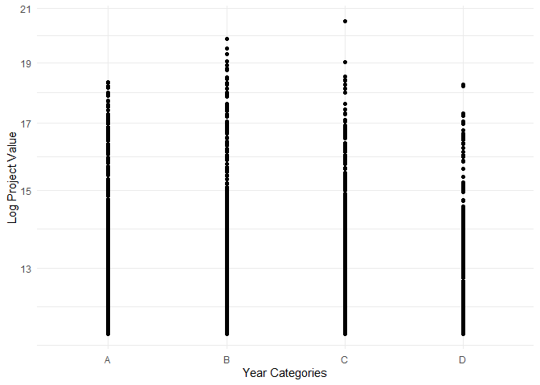<!-- -->

``` r
print(plot2)
```

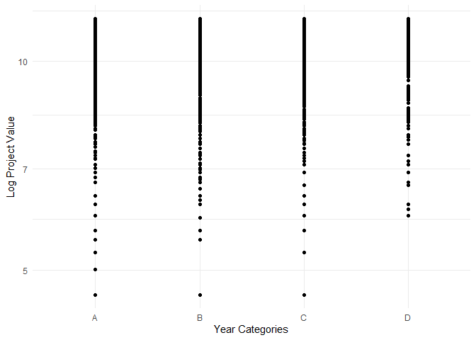<!-- -->

#### Make a graph where it makes sense to customize the alpha transparency

**Assessed Question:** What is the relationship between
*“project_value”* and *“property_use”*?

**Review & Description of Steps:**

- Similar to the previous exercise, The project_value includes values
  of 0. If I transform its value by applying the log, the log
  transformation will produce infinite values. Therefore, for the
  purpose of producing this plot I will remove the 0 values from this
  variable.

- I also had to exclude project_Values =\<10 (mainly with values =1) to
  prevent producing infinite values by log transformation. There is only
  one project_value with value=10.

- In this context, as the variable “property_use” encompasses 13
  distinct categories, I will generate three separate, more focused data
  frames. This step is essential to prevent overcrowding on the x-axis
  when generating plots for property use.

``` r
# Data with "project_value" >=10 and "property_use" in "Cultural/Creational Use", "Dwelling Use", "Institutional Use","Live_Work Use"
data_temp3 <- prepared_building_data2 %>%
  filter(!is.na(project_value) & project_value >=10 & prop_use2 %in% c("Cultral/Creational Use", "Dwelling Use", "Institutional Use","Live_Work Use" )
  ) %>% 
  select(project_value, prop_use2)


# Plot data_temp3
plot_alpha <- ggplot(data = data_temp3 , aes(x = prop_use2, y = log(project_value))) +
  geom_point(color = "blue", size = 3, alpha = 0.5) +  # Set color, size, and alpha transparency
  scale_y_continuous(trans = "log10") +  # Apply log transformation to the y-axis
  labs(x = "Propery Use", y = "Log Project Value") +  # Customize axis labels
  theme_minimal()


# Data with "project_value" >=10 and "property_use" in "Manufacturing Use", "Office Use", "Parking Use","Retail Use"
data_temp4 <- prepared_building_data2 %>%
  filter(!is.na(project_value) & project_value >=10 & prop_use2 %in% c("Manufacturing Use", "Office Use", "Parking Use","Retail Use")
  ) %>% 
  select(project_value, prop_use2)

# Plot data_temp4
plot_alpha2 <- ggplot(data = data_temp4 , aes(x = prop_use2, y = log(project_value))) +
  geom_point(color = "red", size = 3, alpha = 0.5) +  # Set color, size, and alpha transparency
  scale_y_continuous(trans = "log10") +  # Apply log transformation to the y-axis
  labs(x = "Propery Use", y = "Log Project Value") +  # Customize axis labels
  theme_minimal()


# Data with "project_value" >=10 and "property_use" in "Service Use", "Transport Use", "Utility","Wholesale", "Other"
data_temp5 <- prepared_building_data2 %>%
  filter(!is.na(project_value) & project_value >=10 & prop_use2 %in% c("Service Use", "Transport Use", "Utility","Wholesale", "Other")
  ) %>% 
  select(project_value, prop_use2)

# Plot data_temp5
plot_alpha3 <- ggplot(data = data_temp5 , aes(x = prop_use2, y = log(project_value))) +
  geom_point(color = "darkgreen", size = 3, alpha = 0.5) +  # Set color, size, and alpha transparency
  scale_y_continuous(trans = "log10") +  # Apply log transformation to the y-axis
  labs(x = "Propery Use", y = "Log Project Value") +  # Customize axis labels
  theme_minimal()

# Print the plots output
print(plot_alpha)
```

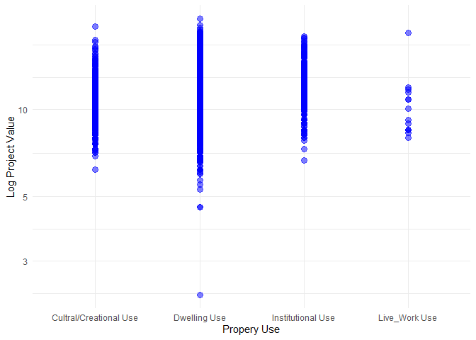<!-- -->

``` r
print(plot_alpha2)
```

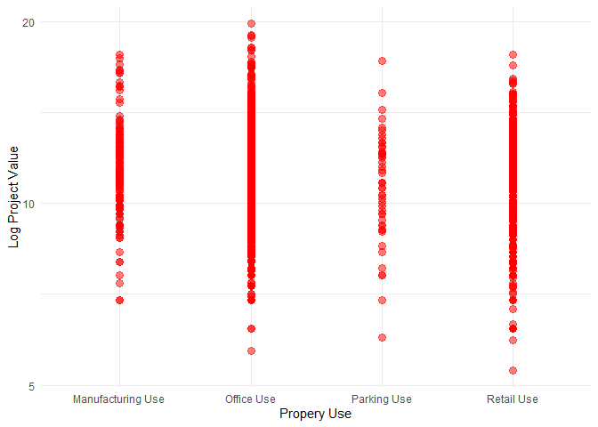<!-- -->

``` r
print(plot_alpha3)
```

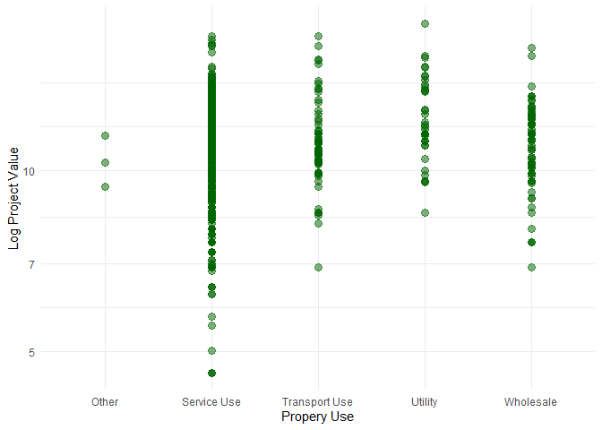<!-- -->

#### Create a graph that has at least two geom layers

**Assessed Question:** What is the relationship between *“year”* and
*“property_use”*?

**Review & Description of Steps:**

- To properly conduct this exercise, I will need to extend the research
  question to look at the interplay between the three following
  variables: “year”, “property_use” and “project_value”.

- Similar to the previous exercise, since the variable “property_use”
  encompasses 13 categories, I will generate three separate, more
  focused data frames to prevent overcrowding on the x-axis when
  generating plots.

- Similar to previous exercises, I will continue working with the
  log(project_value) as it produces a cleaner plot, and will include
  project_value \>=10 to prevent producing infinite values.

**Interesting Finding**

- I had an interesting observation: despite “Live_work” use having the
  highest mean “project_value” in previous exercises, our plot showed no
  log project value for this category in 2017. However, in 2019, it had
  the highest log project value.

``` r
# Data with "project_value" >=10 and "property_use" in "Cultural/Creational Use", "Dwelling Use", "Institutional Use","Live_Work Use"
data_temp6 <- prepared_building_data2 %>%
  filter(
    !is.na(project_value),
    !is.na(prop_use2),
    !is.na(year_cat),
    project_value >= 10,
    prop_use2 %in% c("Cultral/Creational Use", "Dwelling Use", "Institutional Use","Live_Work Use" )
  ) %>%
  select(project_value, prop_use2, year_cat)

# Plot the data_temp6
plot_geomlayer <- ggplot(data_temp6, aes(x = year_cat, y = log(project_value), fill = prop_use2)) +
  geom_bar(stat = "identity", position = "dodge") +
  labs(x = "Year Category", y = "Log Project Value") +
  scale_y_continuous(trans = "log10") +
  scale_fill_manual(values = c("Cultral/Creational Use" = "green", "Dwelling Use" = "red", "Institutional Use" = "yellow", "Live_Work Use" = "blue")) +
  theme_minimal()

# Data with "project_value" >=10 and "property_use" in "Manufacturing Use", "Office Use", "Parking Use","Retail Use"
data_temp7 <- prepared_building_data2 %>%
  filter(
    !is.na(project_value),
    !is.na(prop_use2),
    !is.na(year_cat),
    project_value >= 10,
    prop_use2 %in% c("Manufacturing Use", "Office Use","Parking Use", "Retail Use")
  ) %>%
  select(project_value, prop_use2, year_cat)

# Plot the data_temp7
plot_geomlayer2 <- ggplot(data_temp7, aes(x = year_cat, y = log(project_value), fill = prop_use2)) +
  geom_bar(stat = "identity", position = "dodge") +
  labs(x = "Year Category", y = "Log Project Value") +
  scale_y_continuous(trans = "log10") +
  scale_fill_manual(values = c("Manufacturing Use" = "darkgreen", "Office Use" = "purple", "Parking Use" = "yellow", "Retail Use" = "orange")) +
  theme_minimal()


# Data with "project_value" >=10 and "property_use" in "Service Use", "Transport Use", "Utility","Wholesale", "Other"
data_temp8 <- prepared_building_data2 %>%
  filter(
    !is.na(project_value),
    !is.na(prop_use2),
    !is.na(year_cat),
    project_value >= 10,
    prop_use2 %in% c("Service Use", "Transport Use","Utility", "Wholesale", "Other")
  ) %>%
  select(project_value, prop_use2, year_cat)

# Plot the data_temp8
plot_geomlayer3 <- ggplot(data_temp8, aes(x = year_cat, y = log(project_value), fill = prop_use2)) +
  geom_bar(stat = "identity", position = "dodge") +
  labs(x = "Year Category", y = "Log Project Value") +
  scale_y_continuous(trans = "log10") +
  scale_fill_manual(values = c("Service Use" = "violet", "Transport Use" = "salmon", "Wholesale" = "wheat", "Other" = "maroon", "Utility" = "sienna")) +
  theme_minimal()


# Print the plots output
print(plot_geomlayer)
```

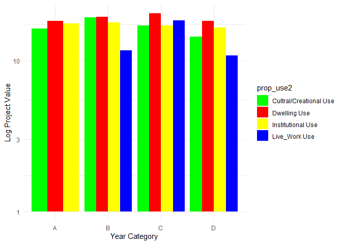<!-- -->

``` r
print(plot_geomlayer2)
```

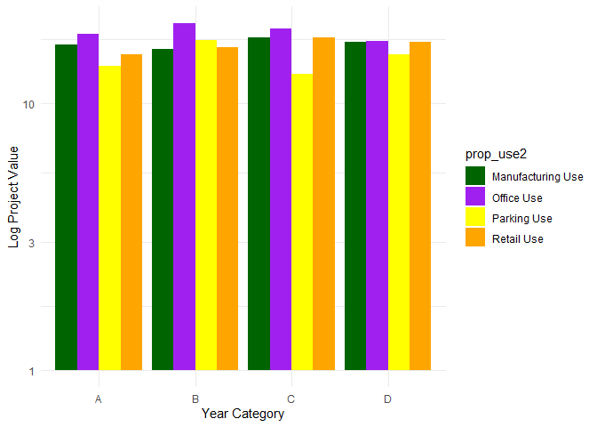<!-- -->

``` r
print(plot_geomlayer3)
```

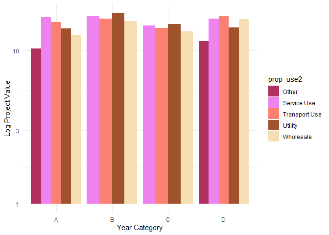<!-- -->

#### Create 3 histograms, with each histogram having different sized bins. Pick the “best” one and explain why it is the best

**Assessed Question:** What factors are associated with higher or lower
mean project value?

- To answer this question properly, I need to carefully explore all the
  usable and potentially relevant variables in the data.

- Histograms are used for visualizing the distribution of a single
  numeric variable.

- The dataset I have prepared has three numeric values: “project_value”,
  “year”, and “bi_id”.

- I will produce three histograms for the above numeric variables to
  better understand their distribution.

- Creating a histogram for a variable with a wide range of values
  require some customization to ensure that the histogram provides
  meaningful insights.

**Winning Histogram**

- I choose histogram 3, the histogram that shows the distribution of
  “year” in the data.This histogram is particularly straightforward to
  interpret. It allows us to quickly discern that the year 2018 has the
  most significant distribution, whereas the year 2020 exhibits the
  lowest distribution. Furthermore, it is evident that there is a
  decrease in distribution from 2018 to 2020.We should regardless be
  mindful that having too few bins can oversimplify the data.

- Histogram 1(bi_id) has many bins that leads to overwhelming level of
  detail and it’s challenging to visualize the data distribution due to
  its wide-ranging values.

- Histogram 2(project_value) is in log-scale and the x-axis is not easy
  to interpret. The number of bins are okay, however, the data
  interpretability still is slightly challenging.

``` r
### The variable bi_id has a minimum of 1 and a maximum of 20,680, and require some customization to ensure that the histogram provides meaningful insights. I am choosing the bandwidth of 500 for this reason to produce a meaningful graph. 

# Histogram 1 for the bi_id variable
hist1 <- ggplot(prepared_building_data2 , aes(x =bi_id)) +
  geom_histogram(binwidth = 500, fill= "pink", color= "grey") +
  labs(title = "Histogram for bi_id", x = "bi_id", y = "Frequency") +
  theme_minimal()

### The variable "project_value" has a min 0 and max 807,185,500 which also require some customization. I have used a log scale for the x-axis to better visualize the distribution of data across this wide range.

# Filter data to prevent production of infinite values when applying the log scale
data_temp9 <- prepared_building_data2 %>%
  filter(project_value >= 10)
  
# Histogram 2 with a log scale on the x-axis
hist2 <- ggplot(data_temp9, aes(x = project_value)) +
  geom_histogram(binwidth = 0.2, fill = "turquoise", color = "black") + 
  labs(title = "Histogram for project_value (log scale)", x = "project_value", y = "Frequency") +
  scale_x_continuous(trans = "log10") +  # Apply log10 transformation to x-axis
  theme_minimal()


#Histogram 3 for the year variable
hist3 <- ggplot(prepared_building_data2 , aes(x = year)) +
  geom_histogram(binwidth = 1, fill= "gold", color= "violet") +
  labs(title = "Histogram for year", x = "year", y = "Frequency") +
  theme_minimal()

# Print the histograms
print(hist1)
```

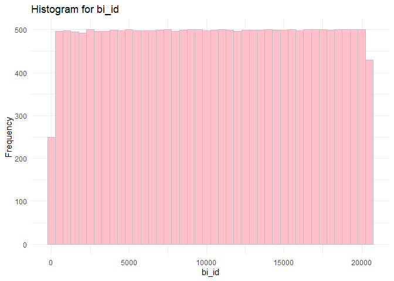<!-- -->

``` r
print(hist2)
```

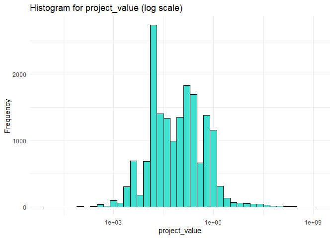<!-- -->

``` r
print(hist3)
```

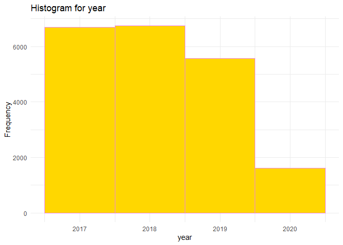<!-- -->

<!----------------------------------------------------------------------------->

## 1.3. Reconsider Your Research Questions (2 points)

Based on the operations that you’ve completed, how much closer are you
to answering your research questions? Think about what aspects of your
research questions remain unclear. Can your research questions be
refined, now that you’ve investigated your data a bit more? Which
research questions are yielding interesting results?

<!------------------------- Write your answer here ---------------------------->

**Summary of Research Questions Evaluated in the MDA, both M1 and M2:**

- What is the relationship between **“*project_value”*** and
  ***“year”***?
- What is the relationship between ***“project_value”*** and
  ***“property_use”***?
- What is the relationship between ***“year”*** and
  ***“property_use”***?
- What is the relationship between **“project_value”** and
  **“type_of_work”**?  
- What factors are associated with higher or lower mean project value?

**Interesting Findings:**

- In MDA_M1, we observed that within groups A (Addition/Alteration) and
  B (Demolition/Destruction), project values falling into the “Ten
  Thousands” and “Hundred Thousands” categories were more prevalent.
  Conversely, in category E (Salvage and Abatement), project values
  categorized as “Ones” were more common. We further observed that
  category C (new buildings) had the highest mean project value, and
  category E had the lowest mean project value.

- We observed that the year 2018 has the highest mean project value at
  739,341.3, and it also has the widest range and highest standard
  deviation, indicating greater variability. In contrast, the year 2017
  has the lowest mean project value at 451,799.9, and it has the lowest
  variability with a smaller range and standard deviation. Additionally,
  there was a decline in the mean project value from 2018-2020.

- In terms of property use, we observed that “Live_Work Use” category
  had the highest mean project value of approximately 6,895,107.14, with
  a range from 3,000 to 96,000,000.

- Interestingly, when we evaluated the interplay of “property_use” and
  “year”, despite “Live_work” use having the highest mean
  “project_value”, our plot showed no log project value for this
  category in 2017. However, in 2019, it had the highest log project
  value. We also found out the category “Dwelling Use” exhibited the
  highest count across all the year categories.

**Limitations and What Remains Unclear**

- My independent factor (Y) is “project_value.” Upon a thorough
  examination of this factor, I’ve observed a significant variation in
  the data, ranging from zero to hundreds of millions. I’m interested in
  understanding the reasons behind this substantial data range. While
  there are certain variables that might provide partial explanations, I
  believe there are unaccounted factors or undisclosed variables in this
  dataset that are contributing to the broader variability, making it
  challenging to fully comprehend the underlying reasons for this wide
  data range.

- This dataset includes a relatively short time span, only four years
  from 2017 to 2020. While this time frame could be viewed as a
  constraint in the analysis, it might align with the primary purpose of
  collecting the data. I lack knowledge about the main rationale behind
  gathering this data, and it’s plausible that its significance is
  concentrated within the 2017-2020 period. Interestingly, we observed a
  decline in the frequency of observations between 2017-2020.

- Regrettably, I couldn’t attain a thorough comprehension of the
  variables “building_contractor” or “bi_id”. In theory, I believe that
  contractors could play a role in determining project value. However,
  due to the coding of this variable, I encountered difficulties in
  creating a new categorical variable that could better encapsulate the
  essence of “building_contractor” and make it more usable for analysis.

- Another noteworthy aspect of this analysis is the relatively large
  number of categories present within the chosen categorical variables.
  This abundance of categories can potentially complicate the
  interpretation of the analysis.

**Am I Close to Answering My Main Research Question/Do I need to Refine
the Research Question:**

- Based on the evaluations made earlier, it appears that I am nearing a
  conclusion regarding my primary research inquiry, which involves
  identifying the factors impacting project value. I intend to focus on
  the mean project value, and for the purposes of building the model, I
  have selected the variables “type_of_work,” the modified
  “property_use” (prop_use2), and a categorical representation of
  “year”. This particular research inquiry is centered on constructing a
  predictive model designed to identify the variables that account for
  variations in the mean project value.

- After the data exploration, I am also intrigued to build a confounding
  model that evaluates the impact of property usage on mean project
  value, while controlling for work type. This research question is
  focused on constructing a confounding model.

<!----------------------------------------------------------------------------->

# Task 2: Tidy Your Data

In this task, we will do several exercises to reshape our data. The goal
here is to understand how to do this reshaping with the `tidyr` package.

A reminder of the definition of *tidy* data:

- Each row is an **observation**
- Each column is a **variable**
- Each cell is a **value**

## 2.1. Is My Data Tidy or Untidy? Explain (2 points)

Based on the definition above, can you identify if your data is tidy or
untidy? Go through all your columns, or if you have \>8 variables, just
pick 8, and explain whether the data is untidy or tidy.

<!--------------------------- Start your work below --------------------------->

- Based on the below investigation, I have determined that my dataset
  adheres to the principles of a tidy dataset.
- Each row serves as an individual observation, without any duplicate
  measurements.
- Each column represents a distinct variable, and there are no absent
  values, as every cell contains data.

``` r
### Assess how tidy the data is 

# Select the variables that I will work with moving forward
building_permits_selected <- prepared_building_data2 %>%
  select(permit_number, issue_date, year, year_cat, project_value, value, type_of_work, prop_use2)

#View the dataset
view(building_permits_selected)

# Check for duplicates in a "permit_number" column
duplicates <- duplicated(building_permits_selected$permit_number)

# Print the rows with duplicate values
# print(duplicates) ### I have commented this out because the output is super long; no duplicates are identified!

# Check for duplicates across the entire data frame
duplicates_entiredata <- building_permits_selected[duplicated(building_permits_selected) | duplicated(building_permits_selected, fromLast = TRUE), ]

# Print duplicates entire data
print(duplicates_entiredata)
```

    ## # A tibble: 0 × 8
    ## # ℹ 8 variables: permit_number <chr>, issue_date <date>, year <dbl>,
    ## #   year_cat <chr>, project_value <dbl>, value <chr>, type_of_work <chr>,
    ## #   prop_use2 <chr>

``` r
# Calculate the total number of missing values in each column
missing_values <- colSums(is.na(building_permits_selected))

# Print missing values
print(missing_values)
```

    ## permit_number    issue_date          year      year_cat project_value 
    ##             0             0             0             0             0 
    ##         value  type_of_work     prop_use2 
    ##             0             0             0

<!----------------------------------------------------------------------------->

## 2.2. Untidy the Tidy Data! (4 points)

Now, if your data is tidy, untidy it! Then, tidy it back to it’s
original state.

If your data is untidy, then tidy it! Then, untidy it back to it’s
original state.

Be sure to explain your reasoning for this task. Show us the “before”
and “after”.

<!--------------------------- Start your work below --------------------------->

To untidy a tidy dataset, I’ll need to introduce redundancy, reshape the
data, or combine information into single cells.The specific rationale
for doing this depends on analysis needs or the requirements of a
particular data visualization or modeling technique.

I intend to utilize the organized format of my existing data for the
regression model and the rest of the questions. The reason for
restructuring/untidying the data is to address the specific question
posed in task2.2. I will also include brief explanations for each step I
undertake and their potential applications.

**Part 1:**

``` r
### To view the tidy data before the untidy process, we can use the view()
view(building_permits_selected) #tidy data

### The provided codes will extract the month from the date column and then generate columns representing the 12 months of the year with their corresponding year values. Reorganizing the data in this manner assists in visually assessing whether we have data spanning all 12 months for the years 2017-2020 or if only specific months of the year contain data. Structuring the dataset in this way is also beneficial when conducting time-series analysis.

 
# Extract the month from the 'issue_date' column
untidy_building_data <- building_permits_selected %>%
  mutate(month = month(as.Date(issue_date)))

# Pivot the 'month' values into separate columns with 'year' values using the spread()
untidy_building_data <- untidy_building_data %>%
  spread(key = month, value = year)

# Print the untidy data
print(untidy_building_data)
```

    ## # A tibble: 20,623 × 19
    ##    permit_number issue_date year_cat project_value value  type_of_work prop_use2
    ##    <chr>         <date>     <chr>            <dbl> <chr>  <chr>        <chr>    
    ##  1 BP-2016-02248 2017-02-01 A                    0 Ones   E            Dwelling…
    ##  2 BU468090      2017-02-01 A                    0 Ones   C            Dwelling…
    ##  3 DB-2016-04450 2017-02-01 A                35000 Ten T… A            Dwelling…
    ##  4 DB-2017-00131 2017-02-01 A                15000 Ten T… A            Office U…
    ##  5 DB452250      2017-02-01 A               181178 Hundr… C            Dwelling…
    ##  6 BP-2016-01458 2017-02-02 A                    0 Ones   E            Dwelling…
    ##  7 BP-2016-02022 2017-02-02 A                15000 Ten T… B            Dwelling…
    ##  8 BP-2016-02424 2017-02-02 A                    0 Ones   E            Dwelling…
    ##  9 BP-2016-02588 2017-02-02 A             65000000 Ten M… C            Dwelling…
    ## 10 BP-2016-03697 2017-02-02 A                25000 Ten T… A            Dwelling…
    ## # ℹ 20,613 more rows
    ## # ℹ 12 more variables: `1` <dbl>, `2` <dbl>, `3` <dbl>, `4` <dbl>, `5` <dbl>,
    ## #   `6` <dbl>, `7` <dbl>, `8` <dbl>, `9` <dbl>, `10` <dbl>, `11` <dbl>,
    ## #   `12` <dbl>

``` r
### Reverse the above code and return the data to its original form

# Use gather to convert the wide format to a long format 
tidy_building_data <- untidy_building_data %>%
  gather(key = "month", value = "year", 
         -permit_number, -issue_date, -year_cat, -value, -project_value, -type_of_work, -prop_use2, 
         na.rm = TRUE)

# Print the tidy data
print(tidy_building_data)
```

    ## # A tibble: 20,623 × 9
    ##    permit_number issue_date year_cat project_value value  type_of_work prop_use2
    ##    <chr>         <date>     <chr>            <dbl> <chr>  <chr>        <chr>    
    ##  1 BP-2018-06367 2019-01-02 C                 5000 Thous… A            Cultral/…
    ##  2 DB-2017-04992 2019-01-02 C                 5000 Thous… A            Dwelling…
    ##  3 BP-2018-03581 2019-01-03 C                15000 Ten T… B            Dwelling…
    ##  4 BP-2018-05408 2019-01-03 C               200000 Hundr… A            Dwelling…
    ##  5 BP-2018-05709 2019-01-03 C               106000 Hundr… A            Office U…
    ##  6 BP-2018-05836 2019-01-03 C                    0 Ones   E            Dwelling…
    ##  7 BP-2018-05863 2019-01-03 C                    0 Ones   E            Dwelling…
    ##  8 BP-2018-05969 2019-01-03 C                    0 Ones   E            Dwelling…
    ##  9 BP-2018-06359 2019-01-03 C                60000 Ten T… A            Office U…
    ## 10 BP-2018-06580 2019-01-03 C                90000 Ten T… A            Dwelling…
    ## # ℹ 20,613 more rows
    ## # ℹ 2 more variables: month <chr>, year <dbl>

``` r
#Original tidy dataset
Original_data <- tidy_building_data %>%
  select(-month)

#Print the original data
print(Original_data)
```

    ## # A tibble: 20,623 × 8
    ##    permit_number issue_date year_cat project_value value  type_of_work prop_use2
    ##    <chr>         <date>     <chr>            <dbl> <chr>  <chr>        <chr>    
    ##  1 BP-2018-06367 2019-01-02 C                 5000 Thous… A            Cultral/…
    ##  2 DB-2017-04992 2019-01-02 C                 5000 Thous… A            Dwelling…
    ##  3 BP-2018-03581 2019-01-03 C                15000 Ten T… B            Dwelling…
    ##  4 BP-2018-05408 2019-01-03 C               200000 Hundr… A            Dwelling…
    ##  5 BP-2018-05709 2019-01-03 C               106000 Hundr… A            Office U…
    ##  6 BP-2018-05836 2019-01-03 C                    0 Ones   E            Dwelling…
    ##  7 BP-2018-05863 2019-01-03 C                    0 Ones   E            Dwelling…
    ##  8 BP-2018-05969 2019-01-03 C                    0 Ones   E            Dwelling…
    ##  9 BP-2018-06359 2019-01-03 C                60000 Ten T… A            Office U…
    ## 10 BP-2018-06580 2019-01-03 C                90000 Ten T… A            Dwelling…
    ## # ℹ 20,613 more rows
    ## # ℹ 1 more variable: year <dbl>

**Part 2:**

In part 2, I will Widen the dataset to display the ‘type_of_work’ for
each categorical representation of the ‘project_value,’ with ‘value’
being placed into its individual column. This activity can simplifies
data presentation. Widening data can make the data presentation more
compact and easier to understand, especially when you have many rows of
data with repeated values in a certain column.It can also improve
readability and data visualization.

``` r
# Widen the data so that we see the type_of_work by each categorical representation of the project_value
# Put "value" as its own column
untidy_building_data2 <- building_permits_selected %>%
    pivot_wider(names_from = value,
                values_from = type_of_work)

# Print the untidy data2
print(untidy_building_data2)
```

    ## # A tibble: 20,623 × 15
    ##    permit_number issue_date  year year_cat project_value prop_use2    Ones 
    ##    <chr>         <date>     <dbl> <chr>            <dbl> <chr>        <chr>
    ##  1 BP-2016-02248 2017-02-01  2017 A                    0 Dwelling Use E    
    ##  2 BU468090      2017-02-01  2017 A                    0 Dwelling Use C    
    ##  3 DB-2016-04450 2017-02-01  2017 A                35000 Dwelling Use <NA> 
    ##  4 DB-2017-00131 2017-02-01  2017 A                15000 Office Use   <NA> 
    ##  5 DB452250      2017-02-01  2017 A               181178 Dwelling Use <NA> 
    ##  6 BP-2016-01458 2017-02-02  2017 A                    0 Dwelling Use E    
    ##  7 BP-2016-02022 2017-02-02  2017 A                15000 Dwelling Use <NA> 
    ##  8 BP-2016-02424 2017-02-02  2017 A                    0 Dwelling Use E    
    ##  9 BP-2016-02588 2017-02-02  2017 A             65000000 Dwelling Use <NA> 
    ## 10 BP-2016-03697 2017-02-02  2017 A                25000 Dwelling Use <NA> 
    ## # ℹ 20,613 more rows
    ## # ℹ 8 more variables: `Ten Thousands` <chr>, `Hundred Thousands` <chr>,
    ## #   `Ten Millions` <chr>, Thousands <chr>, Millions <chr>, Hundreds <chr>,
    ## #   `Hundred Millions` <chr>, Tens <chr>

``` r
### Reverse the above code and return the data to its original form

# Use pivot_longer to convert the wide format to a long format 
tidy_building_data2 <- untidy_building_data2 %>%
  pivot_longer(
    cols = -c(permit_number, issue_date, year_cat, project_value, prop_use2, year),
    names_to = "value", 
    values_to = "type_of_work",
    values_drop_na = TRUE
  )

# Print the tidy data, which should be now similar to the original dataset
print(tidy_building_data2)
```

    ## # A tibble: 20,623 × 8
    ##    permit_number issue_date  year year_cat project_value prop_use2    value     
    ##    <chr>         <date>     <dbl> <chr>            <dbl> <chr>        <chr>     
    ##  1 BP-2016-02248 2017-02-01  2017 A                    0 Dwelling Use Ones      
    ##  2 BU468090      2017-02-01  2017 A                    0 Dwelling Use Ones      
    ##  3 DB-2016-04450 2017-02-01  2017 A                35000 Dwelling Use Ten Thous…
    ##  4 DB-2017-00131 2017-02-01  2017 A                15000 Office Use   Ten Thous…
    ##  5 DB452250      2017-02-01  2017 A               181178 Dwelling Use Hundred T…
    ##  6 BP-2016-01458 2017-02-02  2017 A                    0 Dwelling Use Ones      
    ##  7 BP-2016-02022 2017-02-02  2017 A                15000 Dwelling Use Ten Thous…
    ##  8 BP-2016-02424 2017-02-02  2017 A                    0 Dwelling Use Ones      
    ##  9 BP-2016-02588 2017-02-02  2017 A             65000000 Dwelling Use Ten Milli…
    ## 10 BP-2016-03697 2017-02-02  2017 A                25000 Dwelling Use Ten Thous…
    ## # ℹ 20,613 more rows
    ## # ℹ 1 more variable: type_of_work <chr>

<!----------------------------------------------------------------------------->

## 2.3. Pick Final Research Questions and Explain Your Decision (4 points)

Now, you should be more familiar with your data, and also have made
progress in answering your research questions. Based on your interest,
and your analyses, pick 2 of the 4 research questions to continue your
analysis in the remaining tasks:

<!-------------------------- Start your work below ---------------------------->

1.  \*What factors are associated with higher or lower mean project
    values? For the purposes of building the model, I have selected the
    variables “type_of_work,” the modified “property_use” (prop_use2),
    and a categorical representation of “year”. This particular research
    inquiry is centered on constructing a predictive model designed to
    identify the variables that account for variations in the mean
    project value.

2.  What is the relationship between ***“project_value”*** and
    ***“property_use”***? I want to evaluate the impact of property
    usage on mean project value, while controlling for work type. This
    research question is focused on constructing a confounding model.

<!----------------------------------------------------------------------------->

Explain your decision for choosing the above two research questions.

<!--------------------------- Start your work below --------------------------->

**Impact of Q1:** This question is critical for understanding the
multiple factors that contribute to project value. It can inform
strategic planning, investment decisions, and resource allocation.
Knowing which factors influence project values allows for better project
management and targeted efforts to maximize project values.

**Impact of Q2:** The impact of this question is important for
disentangling the specific influence of “property_use” on
“project_value” and for gaining a more accurate understanding of the
factors affecting project values. It can help in decision-making related
to property development and investment.

In summary, the first question (predictive modeling) takes a broader
approach, aiming to identify all factors influencing mean project
values. Whereas the second question (confounding model) is more specific
and deals with a particular variable’s relationship while considering
confounders.

Both questions have significant impacts in terms of decision-making and
understanding the drivers of project values, but they serve slightly
different analytical purposes.

<!----------------------------------------------------------------------------->

Now, try to choose a version of your data that you think will be
appropriate to answer these 2 questions. Use between 4 and 8 functions
that we’ve covered so far (i.e. by filtering, cleaning, tidy’ing,
dropping irrelevant columns, etc.).

(If it makes more sense, then you can make/pick two versions of your
data, one for each research question.)

<!--------------------------- Start your work below--------------------------->

Throughout the above process, I have already shaped my preferred
dataset: “*building_permit_selected*”. I have also used different
filtering, cleaning functions already as demonstrated throughout this
deliverable to produce this final selected dataset. Therefore, I will
refrain from making any changes to this dataset.

``` r
# Selected and Tidy Data
view(building_permits_selected)
```

# Task 3: Modelling

## 3.0. Define the Independent Variable (no points)

Pick a research question from 1.2, and pick a variable of interest
(we’ll call it “Y”) that’s relevant to the research question. Indicate
these.

<!-------------------------- Start your work below ---------------------------->

**Research Question**: What factors are associated with higher or lower
mean project value?

**Variable of interest**: Mean “Project_value”

<!----------------------------------------------------------------------------->

## 3.1. Fit a Model (3 points)

Fit a model or run a hypothesis test that provides insight on this
variable with respect to the research question. Store the model object
as a variable, and print its output to screen. We’ll omit having to
justify your choice, because we don’t expect you to know about model
specifics in STAT 545.

- **Note**: It’s OK if you don’t know how these models/tests work. Here
  are some examples of things you can do here, but the sky’s the limit.

  - You could fit a model that makes predictions on Y using another
    variable, by using the `lm()` function.
  - You could test whether the mean of Y equals 0 using `t.test()`, or
    maybe the mean across two groups are different using `t.test()`, or
    maybe the mean across multiple groups are different using `anova()`
    (you may have to pivot your data for the latter two).
  - You could use `lm()` to test for significance of regression
    coefficients.

<!-------------------------- Start your work below ---------------------------->

**QUESTION:** What factors are associated with higher or lower mean
project values? For the purposes of building the model, I have selected
the variables “type_of_work,” the modified “property_use” (prop_use2),
and a categorical representation of “year”. This particular research
inquiry is centered on constructing a predictive model designed to
identify the variables that account for variations in the mean project
value.

**Model Interpretation:**

- This value (0.3879) represents the proportion of the variance in the
  mean “project_value” that is explained by the predictor variables in
  the model. In this case, about 38.79% of the variance is explained.

- **type_of_workC:** This variable has a p-value of 1.76e-11, which is
  very close to zero. This indicates a highly significant relationship
  with the mean “project_value.”

- **prop_use2(Live_Work Use):** This variable has a p-value of 9.26e-05,
  also very close to zero, suggesting a highly significant relationship.

- **prop_use(Office Use):** Although it has a p-value of 0.0979, which
  is just slightly above the common significance level of 0.05, it might
  still be considered marginally significant depending on the
  significance level chosen.

``` r
# Calculate the mean 'project_value' by grouping the data by relevant predictors
mean_project_data <- building_permits_selected %>%
  group_by(type_of_work, prop_use2, year_cat) %>%
  summarize(mean_project_value = mean(project_value, na.rm = TRUE))
```

    ## `summarise()` has grouped output by 'type_of_work', 'prop_use2'. You can
    ## override using the `.groups` argument.

``` r
# Fit a multiple regression model to predict mean 'project_value' based on the specified predictors
model1 <- lm(mean_project_value ~ type_of_work + prop_use2 + year_cat, data = mean_project_data)


# Summarize the model
summary(model1)
```

    ## 
    ## Call:
    ## lm(formula = mean_project_value ~ type_of_work + prop_use2 + 
    ##     year_cat, data = mean_project_data)
    ## 
    ## Residuals:
    ##       Min        1Q    Median        3Q       Max 
    ## -20871160  -1701851    512826   1926345  61128376 
    ## 
    ## Coefficients:
    ##                            Estimate Std. Error t value Pr(>|t|)    
    ## (Intercept)                 -125289    2545946  -0.049   0.9608    
    ## type_of_workB                706086    1944301   0.363   0.7169    
    ## type_of_workC              13954249    1938036   7.200 1.76e-11 ***
    ## type_of_workD               1522453    2552470   0.596   0.5516    
    ## type_of_workE                540006    1942452   0.278   0.7813    
    ## type_of_workF                711394    2305225   0.309   0.7580    
    ## prop_use2Dwelling Use      -3296079    2682984  -1.229   0.2209    
    ## prop_use2Institutional Use -1691217    2830327  -0.598   0.5509    
    ## prop_use2Live_Work Use     19420307    4851280   4.003 9.26e-05 ***
    ## prop_use2Manufacturing Use  -910792    2930217  -0.311   0.7563    
    ## prop_use2Office Use         4786732    2876775   1.664   0.0979 .  
    ## prop_use2Other             -5088462    5460844  -0.932   0.3527    
    ## prop_use2Parking Use       -2963781    3214061  -0.922   0.3577    
    ## prop_use2Retail Use        -2774458    2751441  -1.008   0.3147    
    ## prop_use2Service Use       -1499121    2854863  -0.525   0.6002    
    ## prop_use2Transport Use     -2016359    2903661  -0.694   0.4884    
    ## prop_use2Utility           -2774172    3548458  -0.782   0.4354    
    ## prop_use2Wholesale         -1905318    3110938  -0.612   0.5410    
    ## year_catB                   1435962    1713654   0.838   0.4032    
    ## year_catC                   1622356    1753763   0.925   0.3562    
    ## year_catD                    300550    1891664   0.159   0.8739    
    ## ---
    ## Signif. codes:  0 '***' 0.001 '**' 0.01 '*' 0.05 '.' 0.1 ' ' 1
    ## 
    ## Residual standard error: 8621000 on 173 degrees of freedom
    ## Multiple R-squared:  0.3879, Adjusted R-squared:  0.3171 
    ## F-statistic: 5.482 on 20 and 173 DF,  p-value: 1.059e-10

``` r
model1_obj <- unclass(model1) ### not printing due to a long output
```

**QUESTION:** What is the relationship between ***“project_value”*** and
***“property_use”***? I want to evaluate the impact of property usage on
mean project value, while controlling for work type. This research
question is focused on constructing a confounding model.

I’d like to begin by conducting a t-test to investigate whether there
are variations in the mean project value among various categories of
‘prop_use2’. Following that, I intend to build a regression model to
evaluate the influence of ‘prop_use2’ on the mean project value while
considering the influence of the ‘type of work’.

**Model Interpretation:**

- When controlling for work type, only the property usage (Live Work,
  p=6.18e-05), indicated a significant effect on project value.

- The adjusted R-squared is 0.324, indicating that after adjusting for
  the number of independent variables, about 32.4% of the variability in
  the mean project value is explained by the model.

- The low p-value (1.103e-11) indicates that the model as a whole is
  statistically significant, suggesting that at least one independent
  variable is related to the mean project value.

``` r
# Perform t-tests for each category of 'prop_use2' against the overall mean 'project_value'
t_test_results <- building_permits_selected %>%
  group_by(prop_use2) %>%
  summarise(t_statistic = t.test(project_value)$statistic,
            p_value = t.test(project_value)$p.value)

# View the results
print(t_test_results)
```

    ## # A tibble: 13 × 3
    ##    prop_use2              t_statistic  p_value
    ##    <chr>                        <dbl>    <dbl>
    ##  1 Cultral/Creational Use        1.79 7.43e- 2
    ##  2 Dwelling Use                  8.31 1.08e-16
    ##  3 Institutional Use             5.32 1.68e- 7
    ##  4 Live_Work Use                 1.01 3.33e- 1
    ##  5 Manufacturing Use             3.26 1.31e- 3
    ##  6 Office Use                    4.36 1.34e- 5
    ##  7 Other                         1.82 2.10e- 1
    ##  8 Parking Use                   1.39 1.70e- 1
    ##  9 Retail Use                    5.57 3.09e- 8
    ## 10 Service Use                   6.32 4.27e-10
    ## 11 Transport Use                 2.27 2.60e- 2
    ## 12 Utility                       1.66 1.06e- 1
    ## 13 Wholesale                     2.29 2.46e- 2

``` r
# Fit a multiple regression model to assess the impact of 'prop_use2' on mean 'project_value' while controlling for 'type_of_work'
model2 <- lm(mean_project_value ~ prop_use2 + type_of_work, data = mean_project_data)

# Summarize the model
summary(model2)
```

    ## 
    ## Call:
    ## lm(formula = mean_project_value ~ prop_use2 + type_of_work, data = mean_project_data)
    ## 
    ## Residuals:
    ##       Min        1Q    Median        3Q       Max 
    ## -20499708  -1496331    530242   1641519  61443578 
    ## 
    ## Coefficients:
    ##                            Estimate Std. Error t value Pr(>|t|)    
    ## (Intercept)                  781359    2300135   0.340    0.734    
    ## prop_use2Dwelling Use      -3431468    2663402  -1.288    0.199    
    ## prop_use2Institutional Use -1803961    2812741  -0.641    0.522    
    ## prop_use2Live_Work Use     19738350    4808509   4.105 6.18e-05 ***
    ## prop_use2Manufacturing Use -1014706    2910523  -0.349    0.728    
    ## prop_use2Office Use         4645307    2857358   1.626    0.106    
    ## prop_use2Other             -5986667    5373356  -1.114    0.267    
    ## prop_use2Parking Use       -3040650    3188055  -0.954    0.342    
    ## prop_use2Retail Use        -2886415    2730837  -1.057    0.292    
    ## prop_use2Service Use       -1519507    2837946  -0.535    0.593    
    ## prop_use2Transport Use     -2051533    2885287  -0.711    0.478    
    ## prop_use2Utility           -2728659    3510465  -0.777    0.438    
    ## prop_use2Wholesale         -2030119    3086015  -0.658    0.511    
    ## type_of_workB                837050    1929329   0.434    0.665    
    ## type_of_workC              14036714    1924631   7.293 9.90e-12 ***
    ## type_of_workD               1715211    2519404   0.681    0.497    
    ## type_of_workE                584628    1929526   0.303    0.762    
    ## type_of_workF                837204    2286549   0.366    0.715    
    ## ---
    ## Signif. codes:  0 '***' 0.001 '**' 0.01 '*' 0.05 '.' 0.1 ' ' 1
    ## 
    ## Residual standard error: 8578000 on 176 degrees of freedom
    ## Multiple R-squared:  0.3835, Adjusted R-squared:  0.324 
    ## F-statistic:  6.44 on 17 and 176 DF,  p-value: 1.103e-11

``` r
model2_obj <- unclass(model2) ### not printing due to a long output
```

<!----------------------------------------------------------------------------->

## 3.2. Produce the Relevant Results from the Fitted Models (3 points)

Produce something relevant from your fitted model: either predictions on
Y, or a single value like a regression coefficient or a p-value.

- Be sure to indicate in writing what you chose to produce.
- Your code should either output a tibble (in which case you should
  indicate the column that contains the thing you’re looking for), or
  the thing you’re looking for itself.
- Obtain your results using the `broom` package if possible. If your
  model is not compatible with the broom function you’re needing, then
  you can obtain your results by some other means, but first indicate
  which broom function is not compatible.

<!-------------------------- Start your work below ---------------------------->

**The broom::tidy function:**

- It is used to extract model coefficients and related statistics from a
  fitted model. It produces a tibble that typically includes the
  following columns:

- **term:** This column contains the names of model parameters, which
  are usually the predictor variables and the intercept (if present).

- **statistic:** The statistic column typically includes the t-statistic
  for hypothesis testing, which is calculated as the ratio of the
  coefficient estimate to its standard error.

- **p.value:** The p-value column shows the two-tailed p-value
  associated with the t-statistic. It is used to test the null
  hypothesis that the coefficient is equal to zero.

``` r
# The tidy() function extracts various statistics related to the model, including coefficients, standard errors, t-values, and p-values, into a tibble.

### Model 1
broom_tidy1 <- broom::tidy(model1)

# Extract term, p-value, and coefficients
selected_results <- broom_tidy1 %>% 
  select(term, p.value, estimate)

# Print the selected results
print(selected_results)
```

    ## # A tibble: 21 × 3
    ##    term                        p.value  estimate
    ##    <chr>                         <dbl>     <dbl>
    ##  1 (Intercept)                9.61e- 1  -125289.
    ##  2 type_of_workB              7.17e- 1   706086.
    ##  3 type_of_workC              1.76e-11 13954249.
    ##  4 type_of_workD              5.52e- 1  1522453.
    ##  5 type_of_workE              7.81e- 1   540006.
    ##  6 type_of_workF              7.58e- 1   711394.
    ##  7 prop_use2Dwelling Use      2.21e- 1 -3296079.
    ##  8 prop_use2Institutional Use 5.51e- 1 -1691217.
    ##  9 prop_use2Live_Work Use     9.26e- 5 19420307.
    ## 10 prop_use2Manufacturing Use 7.56e- 1  -910792.
    ## # ℹ 11 more rows

``` r
### Model 2
broom_tidy2 <- broom::tidy(model2)

# Extract term, p-value, and coefficients
selected_results2 <- broom_tidy2 %>% 
  select(term, p.value, estimate)

# Print the selected results
print(selected_results2)
```

    ## # A tibble: 18 × 3
    ##    term                        p.value  estimate
    ##    <chr>                         <dbl>     <dbl>
    ##  1 (Intercept)                7.34e- 1   781359.
    ##  2 prop_use2Dwelling Use      1.99e- 1 -3431468.
    ##  3 prop_use2Institutional Use 5.22e- 1 -1803961.
    ##  4 prop_use2Live_Work Use     6.18e- 5 19738350.
    ##  5 prop_use2Manufacturing Use 7.28e- 1 -1014706.
    ##  6 prop_use2Office Use        1.06e- 1  4645307.
    ##  7 prop_use2Other             2.67e- 1 -5986667.
    ##  8 prop_use2Parking Use       3.42e- 1 -3040650.
    ##  9 prop_use2Retail Use        2.92e- 1 -2886415.
    ## 10 prop_use2Service Use       5.93e- 1 -1519507.
    ## 11 prop_use2Transport Use     4.78e- 1 -2051533.
    ## 12 prop_use2Utility           4.38e- 1 -2728659.
    ## 13 prop_use2Wholesale         5.11e- 1 -2030119.
    ## 14 type_of_workB              6.65e- 1   837050.
    ## 15 type_of_workC              9.90e-12 14036714.
    ## 16 type_of_workD              4.97e- 1  1715211.
    ## 17 type_of_workE              7.62e- 1   584628.
    ## 18 type_of_workF              7.15e- 1   837204.

**The broom::augment function:**

- It is used to augment or extend the original dataset with additional
  information related to a model’s predictions and residuals. It
  typically produces a tibble that includes the following columns:

- **Original Data:** The columns from the original dataset are retained,
  allowing you to see the original predictors and response variable.

- **Fitted Values:** This column contains the predicted or fitted values
  generated by the model for each observation in the dataset.

- **Residuals:** The residuals represent the difference between the
  observed values (actual data) and the predicted values generated by
  the model. In other words, it measures how far each data point is from
  the model’s prediction.

``` r
#The broom::augment function is used to augment or extend the original dataset with additional information related to a model's predictions and residuals.

### Model 1

# Use broom's augment() function to extract model augmentation
augmentation1 <- broom::augment(model1)

# Extract original data, fitted values, and residuals
selected_augmentation1 <- augmentation1 %>%
  select(mean_project_value, type_of_work, prop_use2, year_cat, .fitted, .resid)

# Print the selected augmentation
print(selected_augmentation1)
```

    ## # A tibble: 194 × 6
    ##    mean_project_value type_of_work prop_use2            year_cat .fitted  .resid
    ##                 <dbl> <chr>        <chr>                <chr>      <dbl>   <dbl>
    ##  1            621478. A            Cultral/Creational … A        -1.25e5  7.47e5
    ##  2            252930. A            Cultral/Creational … B         1.31e6 -1.06e6
    ##  3           1060430. A            Cultral/Creational … C         1.50e6 -4.37e5
    ##  4            241651  A            Cultral/Creational … D         1.75e5  6.64e4
    ##  5            131714. A            Dwelling Use         A        -3.42e6  3.55e6
    ##  6            173776. A            Dwelling Use         B        -1.99e6  2.16e6
    ##  7            164131. A            Dwelling Use         C        -1.80e6  1.96e6
    ##  8            204124. A            Dwelling Use         D        -3.12e6  3.32e6
    ##  9            513435. A            Institutional Use    A        -1.82e6  2.33e6
    ## 10           1546316. A            Institutional Use    B        -3.81e5  1.93e6
    ## # ℹ 184 more rows

``` r
### Model 2

# Use broom's augment() function to extract model augmentation
augmentation2 <- broom::augment(model2)

# Extract original data, fitted values, and residuals
selected_augmentation2 <- augmentation2 %>%
  select(mean_project_value, type_of_work, prop_use2, .fitted, .resid)

# Print the selected augmentation
print(selected_augmentation2)
```

    ## # A tibble: 194 × 5
    ##    mean_project_value type_of_work prop_use2                .fitted   .resid
    ##                 <dbl> <chr>        <chr>                      <dbl>    <dbl>
    ##  1            621478. A            Cultral/Creational Use   781359. -159881.
    ##  2            252930. A            Cultral/Creational Use   781359. -528429.
    ##  3           1060430. A            Cultral/Creational Use   781359.  279071.
    ##  4            241651  A            Cultral/Creational Use   781359. -539708.
    ##  5            131714. A            Dwelling Use           -2650109. 2781823.
    ##  6            173776. A            Dwelling Use           -2650109. 2823886.
    ##  7            164131. A            Dwelling Use           -2650109. 2814241.
    ##  8            204124. A            Dwelling Use           -2650109. 2854233.
    ##  9            513435. A            Institutional Use      -1022602. 1536038.
    ## 10           1546316. A            Institutional Use      -1022602. 2568919.
    ## # ℹ 184 more rows

**The broom::glance function:**

- It is used to extract a concise summary or glance at various
  goodness-of-fit and model assessment statistics for a fitted model. It
  produces a tibble with a single row containing summary statistics that
  provide an overview of how well the model fits the data. The specific
  statistics included may vary depending on the type of model, but
  common statistics found in the glance tibble include:

- **AIC (Akaike Information Criterion):** A measure of the model’s
  goodness of fit, balancing the trade-off between model complexity and
  fit to the data. Lower AIC values indicate better-fitting models.

- **BIC (Bayesian Information Criterion):** Similar to AIC, BIC is
  another measure of model fit that accounts for model complexity. Lower
  BIC values are preferred.

- **R-squared:** The coefficient of determination, which represents the
  proportion of variance in the dependent variable explained by the
  model. Higher R-squared values indicate better model fit.

- **Adjusted R-squared:** A modified version of R-squared that accounts
  for the number of predictors in the model. It penalizes the inclusion
  of unnecessary variables.

- **Log-Likelihood:** The log-likelihood of the model, a measure of how
  well the model explains the data.

- **Deviance:** A measure of goodness of fit for generalized linear
  models (GLMs). It quantifies the difference between the observed data
  and the model’s predictions.

- **Residual Deviance:** A version of deviance after model fitting in
  GLMs.

- **Null Deviance:** Deviance for a null model with no predictors. It
  helps assess whether the model provides better fit than a null model.

``` r
#The broom::glance function is used to extract a concise summary or glance at various goodness-of-fit and model assessment statistics for a fitted model

### Model1
broom::glance(model1)
```

    ## # A tibble: 1 × 12
    ##   r.squared adj.r.squared    sigma statistic  p.value    df logLik   AIC   BIC
    ##       <dbl>         <dbl>    <dbl>     <dbl>    <dbl> <dbl>  <dbl> <dbl> <dbl>
    ## 1     0.388         0.317 8621166.      5.48 1.06e-10    20 -3362. 6769. 6840.
    ## # ℹ 3 more variables: deviance <dbl>, df.residual <int>, nobs <int>

``` r
### Model2
broom::glance(model2)
```

    ## # A tibble: 1 × 12
    ##   r.squared adj.r.squared    sigma statistic  p.value    df logLik   AIC   BIC
    ##       <dbl>         <dbl>    <dbl>     <dbl>    <dbl> <dbl>  <dbl> <dbl> <dbl>
    ## 1     0.384         0.324 8578002.      6.44 1.10e-11    17 -3363. 6764. 6826.
    ## # ℹ 3 more variables: deviance <dbl>, df.residual <int>, nobs <int>

<!----------------------------------------------------------------------------->

# Task 4: Reading and writing data

Get set up for this exercise by making a folder called `output` in the
top level of your project folder / repository. You’ll be saving things
there.

## 4.1. Make a CSV file in the Output Folder (3 points)

Take a summary table that you made from Task 1, and write it as a csv
file in your `output` folder. Use the `here::here()` function.

- **Robustness criteria**: You should be able to move your Mini Project
  repository / project folder to some other location on your computer,
  or move this very Rmd file to another location within your project
  repository / folder, and your code should still work.
- **Reproducibility criteria**: You should be able to delete the csv
  file, and remake it simply by knitting this Rmd file.

<!-------------------------- Start your work below ---------------------------->

``` r
summary_table <- projval_by_year

#Define the output file path using here::here()
output_file <- here::here("output", "summary_table.csv")

#Write the summary table to a CSV file
write.csv(summary_table, file = output_file, row.names = FALSE)

#Print a message to confirm where the file was saved
cat("Summary table saved to:", output_file, "\n")
```

    ## Summary table saved to: C:/Users/kia_y/SynologyDrive/PhD Library/PhD Courses/STAT545A/Mini Data Analysis/Kiana_Mini-Data-Analysis/output/summary_table.csv

<!----------------------------------------------------------------------------->

## 4.2. Save Model Objects (3 points)

Write your model object from Task 3 to an R binary file (an RDS), and
load it again. Be sure to save the binary file in your `output` folder.
Use the functions `saveRDS()` and `readRDS()`.

- The same robustness and reproducibility criteria as in 4.1 apply here.

<!-------------------------- Start your work below ---------------------------->

``` r
######### Model 1 ######### 

# Save model1 object to an RDS file
model1_file <- here::here("output", "saved_model1.rds")
saveRDS(model1, file = model1_file)

# Print a message to confirm where the file was saved
cat("Model object saved to:", model1_file, "\n")
```

    ## Model object saved to: C:/Users/kia_y/SynologyDrive/PhD Library/PhD Courses/STAT545A/Mini Data Analysis/Kiana_Mini-Data-Analysis/output/saved_model1.rds

``` r
# Load the saved model object from the RDS file
loaded_model1 <- readRDS(model1_file)

print(loaded_model1)
```

    ## 
    ## Call:
    ## lm(formula = mean_project_value ~ type_of_work + prop_use2 + 
    ##     year_cat, data = mean_project_data)
    ## 
    ## Coefficients:
    ##                (Intercept)               type_of_workB  
    ##                    -125289                      706086  
    ##              type_of_workC               type_of_workD  
    ##                   13954249                     1522453  
    ##              type_of_workE               type_of_workF  
    ##                     540006                      711394  
    ##      prop_use2Dwelling Use  prop_use2Institutional Use  
    ##                   -3296079                    -1691217  
    ##     prop_use2Live_Work Use  prop_use2Manufacturing Use  
    ##                   19420307                     -910792  
    ##        prop_use2Office Use              prop_use2Other  
    ##                    4786732                    -5088462  
    ##       prop_use2Parking Use         prop_use2Retail Use  
    ##                   -2963781                    -2774458  
    ##       prop_use2Service Use      prop_use2Transport Use  
    ##                   -1499120                    -2016359  
    ##           prop_use2Utility          prop_use2Wholesale  
    ##                   -2774172                    -1905318  
    ##                  year_catB                   year_catC  
    ##                    1435962                     1622356  
    ##                  year_catD  
    ##                     300550

``` r
######### Model 2 ######### 

# Save model2 object to an RDS file
model2_file <- here::here("output", "saved_model2.rds")
saveRDS(model2, file = model2_file)

# Print a message to confirm where the file was saved
cat("Model object saved to:", model2_file, "\n")
```

    ## Model object saved to: C:/Users/kia_y/SynologyDrive/PhD Library/PhD Courses/STAT545A/Mini Data Analysis/Kiana_Mini-Data-Analysis/output/saved_model2.rds

``` r
# Load the saved model object from the RDS file
loaded_model2 <- readRDS(model2_file)

print(loaded_model2)
```

    ## 
    ## Call:
    ## lm(formula = mean_project_value ~ prop_use2 + type_of_work, data = mean_project_data)
    ## 
    ## Coefficients:
    ##                (Intercept)       prop_use2Dwelling Use  
    ##                     781359                    -3431468  
    ## prop_use2Institutional Use      prop_use2Live_Work Use  
    ##                   -1803961                    19738350  
    ## prop_use2Manufacturing Use         prop_use2Office Use  
    ##                   -1014706                     4645307  
    ##             prop_use2Other        prop_use2Parking Use  
    ##                   -5986667                    -3040650  
    ##        prop_use2Retail Use        prop_use2Service Use  
    ##                   -2886415                    -1519507  
    ##     prop_use2Transport Use            prop_use2Utility  
    ##                   -2051533                    -2728659  
    ##         prop_use2Wholesale               type_of_workB  
    ##                   -2030119                      837050  
    ##              type_of_workC               type_of_workD  
    ##                   14036714                     1715211  
    ##              type_of_workE               type_of_workF  
    ##                     584628                      837204

<!----------------------------------------------------------------------------->

# Overall Reproducibility/Cleanliness/Coherence Checklist

Here are the criteria we’re looking for.

## Coherence (0.5 points)

The document should read sensibly from top to bottom, with no major
continuity errors.

The README file should still satisfy the criteria from the last
milestone, i.e. it has been updated to match the changes to the
repository made in this milestone.

## File and folder structure (1 points)

You should have at least three folders in the top level of your
repository: one for each milestone, and one output folder. If there are
any other folders, these are explained in the main README.

Each milestone document is contained in its respective folder, and
nowhere else.

Every level-1 folder (that is, the ones stored in the top level, like
“Milestone1” and “output”) has a `README` file, explaining in a sentence
or two what is in the folder, in plain language (it’s enough to say
something like “This folder contains the source for Milestone 1”).

## Output (1 point)

All output is recent and relevant:

- All Rmd files have been `knit`ted to their output md files.
- All knitted md files are viewable without errors on Github. Examples
  of errors: Missing plots, “Sorry about that, but we can’t show files
  that are this big right now” messages, error messages from broken R
  code
- All of these output files are up-to-date – that is, they haven’t
  fallen behind after the source (Rmd) files have been updated.
- There should be no relic output files. For example, if you were
  knitting an Rmd to html, but then changed the output to be only a
  markdown file, then the html file is a relic and should be deleted.

Our recommendation: delete all output files, and re-knit each
milestone’s Rmd file, so that everything is up to date and relevant.

## Tagged release (0.5 point)

You’ve tagged a release for Milestone 2.

### Attribution

Thanks to Victor Yuan for mostly putting this together.
